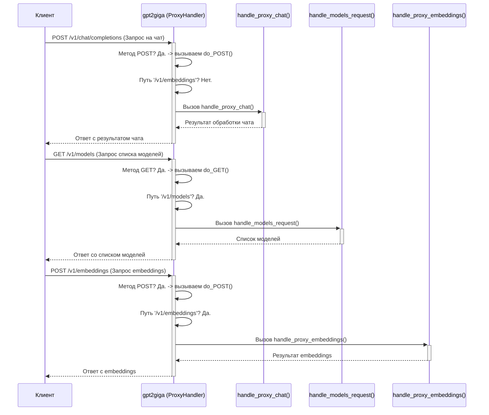

# Chapter 1: Маршрутизация и обработка конечных точек API


Добро пожаловать в мир `gpt2giga`! Этот проект позволяет использовать мощные модели GigaChat от Сбера через интерфейс, совместимый с OpenAI API. Это значит, что многие инструменты, уже работающие с OpenAI, смогут легко переключиться на GigaChat.

В этой первой главе мы разберемся с основой основ любого веб-сервиса: как он понимает, чего от него хотят, и как направляет запросы в нужные "отделы" для обработки. Этот процесс называется **маршрутизацией**.

Представьте, что `gpt2giga` — это большой почтовый сортировочный центр. Ежедневно сюда приходят тысячи писем (сетевых запросов). У каждого письма есть адрес (URL-путь, например, `/v1/chat/completions` или `/v1/models`) и иногда пометка о типе отправления (HTTP-метод, например, GET для запроса информации или POST для отправки данных на обработку). Задача сортировочного центра (`gpt2giga`) — прочитать адрес и тип, а затем отправить письмо в нужный отдел доставки (специальный код-обработчик), который знает, что с ним делать.

## Зачем нужна маршрутизация?

Пользователи могут обращаться к нашему сервису с разными целями:

1.  **Пообщаться с ИИ:** Отправить сообщение и получить ответ. Для этого используется адрес `/v1/chat/completions`.
2.  **Узнать доступные модели:** Получить список моделей ИИ, которые поддерживает сервис. Адрес: `/v1/models`.
3.  **Получить векторные представления текста (embeddings):** Преобразовать текст в числовой формат для задач машинного обучения. Адрес: `/v1/embeddings`.

Каждый из этих запросов требует совершенно разных действий. Маршрутизация — это механизм, который позволяет нашему серверу понять, какой именно запрос пришел, и вызвать соответствующую функцию для его обработки. Без маршрутизации сервер был бы как почтальон, который не умеет читать адреса — полный хаос!

## Ключевые понятия

Давайте разберем основные термины, которые помогут нам понять маршрутизацию:

*   **Конечная точка (Endpoint):** Это конкретный адрес (URL-путь) в нашем API, к которому обращаются клиенты для выполнения определенной операции. Например:
    *   `/v1/chat/completions`: Конечная точка для взаимодействия с чат-моделью.
    *   `/v1/models`: Конечная точка для получения списка моделей.
    *   `/v1/embeddings`: Конечная точка для получения векторных представлений.
    Думайте об этом как о номере кабинета в большом здании, где решают конкретный вопрос.

*   **HTTP-метод (HTTP Method):** Указывает на тип действия, которое клиент хочет выполнить с ресурсом по указанному адресу (конечной точке). Самые распространенные:
    *   `GET`: Запросить данные. Например, получить список моделей (`GET /v1/models`). Похоже на просьбу "Дайте мне информацию".
    *   `POST`: Отправить данные на сервер для обработки или создания нового ресурса. Например, отправить сообщение в чат (`POST /v1/chat/completions`). Похоже на отправку формы или документа на обработку.
    *   `OPTIONS`: Используется браузерами для проверки разрешений перед отправкой "настоящего" запроса (например, POST). Это как спросить "Можно ли мне вообще отправлять сюда такие запросы?".

*   **Обработчик (Handler):** Это конкретная функция в коде нашего сервера, которая отвечает за обработку запросов, приходящих на определенную конечную точку с определенным HTTP-методом. В нашей аналогии с почтой, это конкретный сотрудник или отдел, который вскрывает письмо с определенным адресом и выполняет указанные в нем инструкции.

## Как это работает в `gpt2giga`?

В `gpt2giga` за всю маршрутизацию отвечает класс `ProxyHandler`. Он является "главным диспетчером" нашего сортировочного центра. Этот класс унаследован от стандартного `http.server.SimpleHTTPRequestHandler` из библиотеки Python, что дает ему базовые возможности для обработки HTTP-запросов.

Когда на сервер `gpt2giga` приходит запрос, `ProxyHandler` смотрит на две вещи:

1.  **HTTP-метод:** Был ли это `GET`, `POST` или `OPTIONS`?
2.  **Путь (Path):** Какой URL был запрошен (например, `/v1/models`)?

В зависимости от *метода*, Python автоматически вызывает один из специальных методов `ProxyHandler`:
*   Для `GET`-запросов вызывается метод `do_GET`.
*   Для `POST`-запросов вызывается метод `do_POST`.
*   Для `OPTIONS`-запросов вызывается метод `do_OPTIONS`.

Давайте посмотрим на упрощенную структуру этих методов в `gpt2giga`:

```python
# Файл: gpt2giga/__init__.py (упрощено)

class ProxyHandler(http.server.SimpleHTTPRequestHandler):
    # ... (пропущена инициализация и другие методы)

    def do_GET(self):
        # Если запросили список моделей...
        if self.path in ("/models", "/v1/models"):
            # ...вызываем обработчик для моделей
            self.handle_models_request()
        else:
            # Иначе считаем, что это запрос к чату (нестандартно, но допустимо)
            # или какая-то другая GET-операция, которую может поддерживать совместимое API
            self.handle_proxy_chat() # Обычно чат использует POST, но для гибкости может быть и GET

    def do_POST(self):
        # Если запросили embeddings...
        if self.path in ("/embeddings", "/v1/embeddings"):
            # ...вызываем обработчик для embeddings
            self.handle_proxy_embeddings()
        else:
            # Иначе (скорее всего, /v1/chat/completions) ...
            # ...вызываем обработчик для чата
            self.handle_proxy_chat()

    def do_OPTIONS(self):
        # Просто отвечаем, что разрешены методы GET, POST, OPTIONS
        self.send_response(200)
        self.send_header("Allow", "GET, POST, OPTIONS")
        self._send_CORS_headers() # Отправляем заголовки для CORS (междоменные запросы)
        self.end_headers()

    # ... Определения методов handle_models_request(), handle_proxy_embeddings(), handle_proxy_chat() ...
    # ... и других вспомогательных методов ...
```

**Объяснение кода:**

*   **`do_GET(self)`:** Этот метод автоматически срабатывает, когда приходит `GET`-запрос. Внутри он проверяет `self.path` (это и есть запрошенный URL-путь). Если путь `/models` или `/v1/models`, вызывается функция `self.handle_models_request()`, которая вернет список моделей. В противном случае, для других `GET`-запросов (или если путь не совпал) вызывается `self.handle_proxy_chat()`.
*   **`do_POST(self)`:** Срабатывает на `POST`-запросы. Сначала проверяется, не запрос ли это на получение embeddings (`/embeddings` или `/v1/embeddings`). Если да, вызывается `self.handle_proxy_embeddings()`. Если нет (например, пришел запрос на `/v1/chat/completions`), то вызывается основной обработчик чата `self.handle_proxy_chat()`.
*   **`do_OPTIONS(self)`:** Обрабатывает `OPTIONS`-запросы. Они нужны в основном для веб-браузеров, чтобы проверить, можно ли с веб-страницы отправлять запросы к нашему API (это называется CORS). Метод просто отвечает "ОК, можно использовать GET, POST, OPTIONS".
*   **`handle_...()` методы:** Это и есть те самые "обработчики" или "отделы доставки". `handle_models_request` знает, как сформировать и отдать список моделей. `handle_proxy_embeddings` знает, как обработать запрос на embeddings. А `handle_proxy_chat` — самый сложный, он обрабатывает запросы к чат-модели. Подробнее мы их рассмотрим в следующих главах, особенно [Обработчик запросов прокси (ProxyHandler)](02_обработчик_запросов_прокси__proxyhandler__.md).

## Как это выглядит на практике? (Диаграмма)

Представим два запроса к нашему серверу `gpt2giga`:

1.  Клиент хочет получить список моделей (`GET /v1/models`).
2.  Клиент хочет отправить сообщение в чат (`POST /v1/chat/completions`).

Вот как `ProxyHandler` их обработает:



Эта диаграмма наглядно показывает, как `ProxyHandler` (Сервер) действует как диспетчер: он определяет тип запроса (метод и путь) и передает его соответствующему обработчику (`handle_...` функциям).

## Заглянем глубже в код

Код маршрутизации находится в файле `gpt2giga/__init__.py`, внутри класса `ProxyHandler`. Давайте еще раз посмотрим на ключевые моменты:

```python
# Файл: gpt2giga/__init__.py

class ProxyHandler(http.server.SimpleHTTPRequestHandler):
    # ... (пропущено)

    def do_GET(self):
        # self.path содержит строку с путем запроса, например "/v1/models"
        if self.path in ("/models", "/v1/models"):
            # Если путь совпал, вызываем специальный обработчик
            self.handle_models_request()
        else:
            # Во всех остальных случаях GET-запросов вызываем другой обработчик
            # (В реальном API здесь может быть больше проверок)
            self.handle_proxy_chat() # Или другая логика по умолчанию

    def do_POST(self):
        # Точно так же проверяем путь для POST-запросов
        if self.path in ("/embeddings", "/v1/embeddings"):
            self.handle_proxy_embeddings()
        else:
            # Основной путь для POST - это чат /v1/chat/completions
            self.handle_proxy_chat()

    # ... (остальные методы, включая do_OPTIONS и сами обработчики handle_...)
```

Самое важное здесь — это условия `if self.path in (...)`. Они проверяют адрес (путь) запроса и на основе этого решают, какой метод-обработчик вызвать. Это и есть суть маршрутизации в `gpt2giga`. Сами методы `handle_proxy_chat`, `handle_proxy_embeddings` и `handle_models_request` содержат логику для выполнения конкретных задач, о которой мы поговорим в следующих главах.

## Заключение

В этой главе мы познакомились с концепцией маршрутизации API на примере `gpt2giga`. Мы узнали, что:

*   Маршрутизация — это процесс направления входящих запросов к правильному коду-обработчику на основе URL-пути (конечной точки) и HTTP-метода (GET, POST и т.д.).
*   Это похоже на работу почтового сортировочного центра, где письма направляются в нужные отделы.
*   В `gpt2giga` за маршрутизацию отвечает класс `ProxyHandler`, который использует методы `do_GET`, `do_POST` и `do_OPTIONS`.
*   Внутри этих методов проверяется путь запроса (`self.path`), и вызывается соответствующий метод-обработчик (`handle_models_request`, `handle_proxy_embeddings` или `handle_proxy_chat`).

Теперь, когда мы понимаем, *как* сервер решает, *какой* обработчик вызвать, в следующей главе мы подробнее рассмотрим сам `ProxyHandler` и его основные функции, включая обработку запросов чата.

**Следующая глава:** [Обработчик запросов прокси (ProxyHandler)](02_обработчик_запросов_прокси__proxyhandler__.md)

---

Generated by [AI Codebase Knowledge Builder](https://github.com/The-Pocket/Tutorial-Codebase-Knowledge)