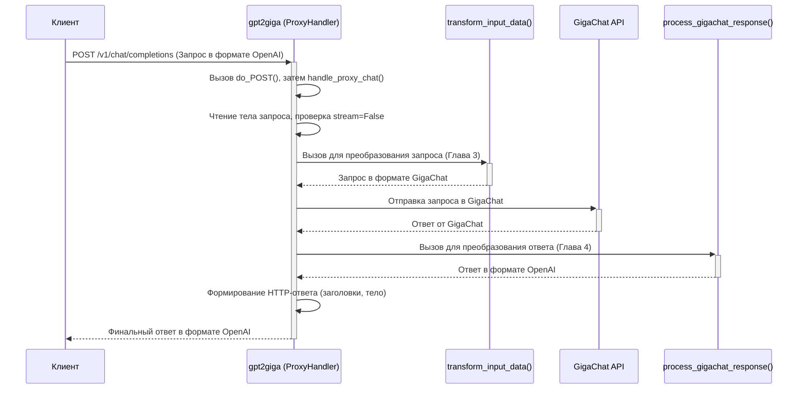

# Chapter 2: Обработчик запросов прокси (ProxyHandler)


В [предыдущей главе](01_маршрутизация_и_обработка_конечных_точек_api_.md) мы узнали, как `gpt2giga` работает как сортировочный центр, направляя входящие запросы (например, `/v1/chat/completions` или `/v1/models`) к правильным методам-обработчикам (`do_POST` или `do_GET`) внутри класса `ProxyHandler`. Мы выяснили, что `ProxyHandler` затем вызывает специфические функции вроде `handle_proxy_chat` или `handle_models_request`.

Теперь давайте поближе познакомимся с самим классом `ProxyHandler`. Это не просто диспетчер, который указывает направление. Представьте его как очень ответственного администратора на ресепшене отеля. Он не только говорит гостю (запросу), в какой номер (обработчик) ему идти, но и сопровождает весь процесс: принимает данные от гостя, передает их в нужный отдел (например, горничной или ресторану), получает ответ от отдела и передает его обратно гостю. `ProxyHandler` — это сердце нашего прокси-сервера, координирующее всю работу.

## Зачем нужен `ProxyHandler`? Какую проблему он решает?

Основная задача `gpt2giga` — позволить приложениям, "говорящим" на языке OpenAI API, общаться с GigaChat API, который "говорит" на немного другом языке. `ProxyHandler` выступает в роли переводчика и координатора этого общения.

Рассмотрим основной сценарий: **отправка сообщения в чат**.
Клиент (например, веб-приложение или скрипт) отправляет запрос в формате OpenAI на адрес `/v1/chat/completions`. `ProxyHandler` должен:
1.  Принять этот запрос.
2.  Понять, что это запрос к чату.
3.  Преобразовать данные запроса из формата OpenAI в формат, понятный GigaChat.
4.  Отправить преобразованный запрос в GigaChat.
5.  Получить ответ от GigaChat.
6.  Преобразовать ответ из формата GigaChat обратно в формат OpenAI.
7.  Отправить финальный ответ клиенту.

`ProxyHandler` сам по себе не выполняет все эти шаги напрямую, но он **оркестрирует** этот процесс, вызывая нужные функции для каждого этапа.

## Ключевые обязанности `ProxyHandler`

Давайте разберем основные задачи, которые выполняет `ProxyHandler` после того, как определен тип запроса (например, стало ясно, что нужно вызвать `handle_proxy_chat`):

1.  **Прием и Чтение Запроса:** Он считывает детали входящего HTTP-запроса, включая заголовки (например, `Content-Type` или `Authorization`) и тело запроса (обычно JSON с данными).
2.  **Предварительная Обработка:** Выполняет некоторые проверки и подготовку. Например:
    *   Определяет, является ли запрос потоковым (`stream=True`) или обычным.
    *   Если включена опция `pass_token`, он извлекает токен авторизации из заголовков и настраивает подключение к GigaChat для использования этого токена.
3.  **Вызов Преобразователей и Отправка:** Внутри методов вроде `handle_proxy_chat`, `ProxyHandler` вызывает другие функции:
    *   **`transform_input_data`:** Эта функция берет данные изначального запроса (в формате OpenAI) и адаптирует их для GigaChat. Подробнее об этом в главе [Преобразование входящего запроса (OpenAI -> GigaChat)](03_преобразование_входящего_запроса__openai____gigachat__.md).
    *   **`send_to_gigachat` / `send_to_gigachat_stream`:** Эти методы отвечают за непосредственное взаимодействие с GigaChat API. Они отправляют подготовленный запрос и получают ответ.
    *   **`process_gigachat_response` / `process_gigachat_stream`:** Эти функции берут ответ от GigaChat и преобразуют его обратно в формат OpenAI, чтобы клиент его понял. Подробнее об этом в главе [Преобразование ответа (GigaChat -> OpenAI)](04_преобразование_ответа__gigachat____openai__.md).
4.  **Формирование и Отправка Ответа:** `ProxyHandler` берет окончательный, преобразованный ответ и отправляет его обратно клиенту, устанавливая правильные HTTP-заголовки (например, `Content-Type: application/json`).

## Как `ProxyHandler` обрабатывает запрос к чату (`handle_proxy_chat`)

Метод `handle_proxy_chat` является одним из самых важных. Давайте посмотрим на его упрощенную структуру и разберем, что происходит шаг за шагом:

```python
# Файл: gpt2giga/__init__.py (упрощенный handle_proxy_chat)

class ProxyHandler(http.server.SimpleHTTPRequestHandler):
    # ... (пропущены другие методы и __init__)

    def handle_proxy_chat(self):
        """
        Обрабатывает запросы к чату, перенаправляя их в GigaChat Chat API
        """
        try:
            # 1. Считать тело запроса
            content_length = int(self.headers.get("Content-Length", 0))
            request_body = self.rfile.read(content_length)
            json_body = json.loads(request_body.decode("utf-8"))

            # 2. Определить, нужен ли потоковый ответ
            stream = json_body.pop("stream", False)

            # (Опционально) 3. Если включен pass_token, получить токен
            if self.pass_token:
                token = self.headers.get("Authorization", "").replace("Bearer ", "", 1)
                self.pass_token_to_gigachat(token) # Настроить GigaChat с этим токеном

            # 4. Отправить базовый ответ "ОК" и заголовки CORS
            self.send_response(200)
            self._send_CORS_headers()

            # 5. Обработать запрос: потоковый или обычный?
            if stream:
                # Потоковый ответ
                self.send_header("Content-Type", "text/event-stream; charset=utf-8")
                # ... (другие заголовки для потока)
                self.end_headers()

                # Вызвать функцию, которая отправит запрос в GigaChat
                # и будет возвращать кусочки (chunks) ответа
                for chunk in self.send_to_gigachat_stream(json_body):
                    # Отправить каждый кусочек клиенту в формате Server-Sent Events
                    chunk_send = f"data: {json.dumps(chunk, ensure_ascii=False)}\r\n\r\n"
                    self.wfile.write(chunk_send.encode("utf-8"))
                # Сообщить клиенту, что поток завершен
                self.wfile.write(b"data: [DONE]\r\n\r\n")

            else:
                # Обычный (непотоковый) ответ
                # Вызвать функцию, которая отправит запрос, получит ПОЛНЫЙ ответ
                # от GigaChat и преобразует его
                giga_resp = self.send_to_gigachat(json_body)
                response_body = json.dumps(giga_resp, ensure_ascii=False).encode("utf-8")

                # Отправить заголовки для обычного JSON ответа
                self.send_header('Content-Type', 'application/json')
                self.send_header('Content-Length', str(len(response_body)))
                # ... (другие стандартные заголовки OpenAI)
                self.end_headers()

                # Отправить тело ответа
                self.wfile.write(response_body)

        except Exception as e:
            # В случае ошибки отправить ответ с кодом 500
            logging.error(f"Ошибка обработки запроса: {e}", exc_info=True)
            self.send_error(500, f"Ошибка обработки запроса: {e}")

    # ... Определения методов _send_CORS_headers, pass_token_to_gigachat,
    # send_to_gigachat_stream, send_to_gigachat ...
```

**Объяснение кода:**

1.  **Чтение запроса:** Код получает размер тела запроса из заголовка `Content-Length`, читает это тело (`self.rfile.read`) и преобразует его из байтов в текст, а затем в объект Python (`json.loads`).
2.  **Проверка `stream`:** Он проверяет, есть ли в JSON поле `stream` со значением `True`. Если да, клиент ожидает ответ по частям (потоком).
3.  **Токен (если `pass_token`):** Если при запуске сервера была указана опция `--pass-token`, код попытается извлечь токен из заголовка `Authorization` и передаст его в специальный метод `pass_token_to_gigachat`, который настроит экземпляр `GigaChat`.
4.  **Базовый ответ:** Сервер отправляет код `200 OK` и заголовки CORS, чтобы браузеры разрешали запросы.
5.  **Обработка потока/не потока:**
    *   **Если `stream`:** Устанавливаются специальные заголовки для потоковой передачи (`text/event-stream`). Затем вызывается `self.send_to_gigachat_stream(json_body)`. Этот метод *не возвращает* сразу весь ответ. Он работает как генератор: по мере поступления ответа от GigaChat, он отдает его маленькими "кусочками" (chunks). Каждый кусочек форматируется (`data: {...}\r\n\r\n`) и немедленно отправляется клиенту (`self.wfile.write`). В конце отправляется специальный маркер `data: [DONE]\r\n\r\n`.
    *   **Если не `stream`:** Вызывается `self.send_to_gigachat(json_body)`. Этот метод ждет *полного* ответа от GigaChat, обрабатывает его и возвращает готовый результат (`giga_resp`). Этот результат преобразуется в JSON-строку (`response_body`), устанавливаются стандартные заголовки для JSON-ответа, и весь ответ отправляется клиенту одним куском.
6.  **Обработка ошибок:** Весь код обернут в `try...except`. Если на любом этапе что-то пойдет не так, будет отправлен ответ об ошибке (`500 Internal Server Error`).

**Ключевая идея:** `handle_proxy_chat` действует как менеджер. Он подготавливает всё необходимое, а затем делегирует основную работу (преобразование данных, общение с GigaChat) другим методам (`send_to_gigachat` или `send_to_gigachat_stream`), которые, в свою очередь, вызывают функции преобразования из глав [3](03_преобразование_входящего_запроса__openai____gigachat__.md) и [4](04_преобразование_ответа__gigachat____openai__.md).

## Внутренний поток обработки запроса (Диаграмма)

Давайте визуализируем путь обычного (непотокового) запроса к чату:



Эта диаграмма показывает, как `ProxyHandler` координирует взаимодействие: получает запрос, вызывает `transform_input_data` для подготовки данных к отправке, общается с `GigaChat API`, затем вызывает `process_gigachat_response` для форматирования ответа перед отправкой клиенту.

## Заглянем глубже в код `ProxyHandler`

Хотя основная логика координации находится в `handle_...` методах, некоторые важные вещи происходят при инициализации и в методах отправки.

**Инициализация (`__init__`)**

Когда сервер запускается, для каждого нового соединения создается экземпляр `ProxyHandler`. Его метод `__init__` получает настройки, переданные при запуске сервера:

```python
# Файл: gpt2giga/__init__.py (упрощенный __init__)

class ProxyHandler(http.server.SimpleHTTPRequestHandler):
    # Переменные класса, которые устанавливаются при запуске сервера
    giga: Optional[GigaChat] = None # Экземпляр для общения с GigaChat
    verbose: bool = False          # Включен ли подробный лог?
    pass_token: bool = False       # Передавать ли токен?
    # ... другие настройки ...

    def __init__(self, *args, **kwargs):
        # Копируем настройки из класса в экземпляр
        self.giga = self.__class__.giga
        self.verbose = self.__class__.verbose
        self.pass_token = self.__class__.pass_token
        # ... копирование других настроек ...
        super().__init__(*args, **kwargs) # Вызов инициализатора родительского класса
```

Этот код показывает, что каждый обработчик запроса получает доступ к общему экземпляру `GigaChat` (созданному один раз при старте) и другим настройкам (`verbose`, `pass_token` и т.д.).

**Отправка в GigaChat (`send_to_gigachat`)**

Этот метод (и его потоковый брат `send_to_gigachat_stream`) содержит логику вызова функций преобразования и непосредственного общения с GigaChat SDK.

```python
# Файл: gpt2giga/__init__.py (упрощенный send_to_gigachat)

class ProxyHandler(http.server.SimpleHTTPRequestHandler):
    # ...

    def send_to_gigachat(self, data: dict) -> dict:
        """
        Отправляет преобразованные данные в GigaChat API и обрабатывает ответ.
        """
        # 1. Преобразовать входящие данные (формат OpenAI -> GigaChat)
        #    Вызывает transform_input_data, как показано на диаграмме
        chat, gpt_model = self.transform_input_data(data)
        #    (Тут есть еще дополнительная логика, например, collapse_messages)
        chat.messages = self.collapse_messages(chat.messages)

        # 2. Отправить запрос в GigaChat с помощью SDK
        giga_resp_raw = self.giga.chat(chat) # Основной вызов API GigaChat

        # 3. Преобразовать ответ (формат GigaChat -> OpenAI)
        #    Вызывает process_gigachat_response, как показано на диаграмме
        result = process_gigachat_response(giga_resp_raw, gpt_model)

        return result # Вернуть готовый к отправке клиенту результат

    # ... (метод send_to_gigachat_stream устроен похоже, но использует self.giga.stream и yield)
    # ... (также здесь определены transform_input_data и collapse_messages)
```

Этот фрагмент подтверждает роль `ProxyHandler` как координатора: он вызывает `transform_input_data` ([Глава 3](03_преобразование_входящего_запроса__openai____gigachat__.md)), затем использует `self.giga.chat` для обращения к GigaChat, и наконец вызывает `process_gigachat_response` ([Глава 4](04_преобразование_ответа__gigachat____openai__.md)) для финальной обработки ответа.

## Заключение

В этой главе мы погрузились в работу `ProxyHandler`. Мы узнали, что это не просто маршрутизатор, а главный координатор обработки запросов в `gpt2giga`. Он отвечает за:

*   Прием и разбор входящих HTTP-запросов.
*   Определение типа запроса (чат, модели, embeddings) и вызов соответствующего `handle_...` метода.
*   Оркестрацию всего процесса обработки внутри `handle_...` методов:
    *   Вызов функций для преобразования запроса из формата OpenAI в формат GigaChat.
    *   Взаимодействие с GigaChat API для получения ответа.
    *   Вызов функций для преобразования ответа из формата GigaChat обратно в формат OpenAI.
    *   Отправку финального ответа клиенту, будь то единый JSON или поток данных.

`ProxyHandler` — это клей, который связывает воедино все части `gpt2giga`, позволяя ему выступать в роли моста между приложениями, ожидающими OpenAI API, и мощью GigaChat.

Теперь, когда мы понимаем, *кто* координирует процесс, самое время разобраться, *как* именно происходит первый важный шаг этой координации: преобразование запроса от клиента.

**Следующая глава:** [Преобразование входящего запроса (OpenAI -> GigaChat)](03_преобразование_входящего_запроса__openai____gigachat__.md)

---

Generated by [AI Codebase Knowledge Builder](https://github.com/The-Pocket/Tutorial-Codebase-Knowledge)