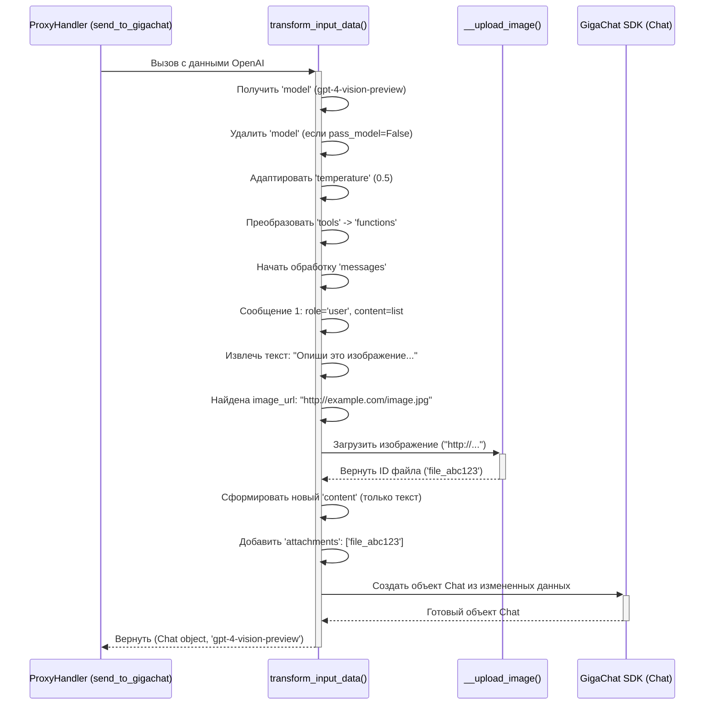

# Chapter 3: Преобразование входящего запроса (OpenAI -> GigaChat)


В [предыдущей главе](02_обработчик_запросов_прокси__proxyhandler__.md) мы узнали, что `ProxyHandler` — это главный координатор нашего сервера `gpt2giga`. Он принимает запросы от клиента и решает, как их обработать. Мы видели, что для обработки чат-запросов (`handle_proxy_chat`), `ProxyHandler` вызывает другие, более специализированные функции.

Одной из самых важных задач, которую координирует `ProxyHandler`, является **преобразование входящего запроса**. Представьте, что клиент говорит на "языке OpenAI", а GigaChat понимает только "язык GigaChat". Они похожи, но есть отличия в грамматике и некоторых словах. `gpt2giga` должен выступить в роли **переводчика**, чтобы GigaChat понял, чего от него хочет клиент.

Эта глава посвящена именно этому "переводчику" — части кода, которая берет запрос в формате OpenAI и адаптирует его для GigaChat.

## Зачем нужно преобразовывать запрос?

Хотя и OpenAI API, и GigaChat API предназначены для работы с большими языковыми моделями, детали их интерфейсов (API) различаются. Если мы просто отправим запрос, предназначенный для OpenAI, напрямую в GigaChat, он, скорее всего, не поймет его и вернет ошибку.

**Пример:** Представьте, вы хотите попросить ИИ написать стихотворение.

*   **Клиент (говоря на "языке OpenAI")** может отправить что-то вроде:
    ```json
    {
      "model": "gpt-4",
      "messages": [
        {"role": "system", "content": "Ты - помощник-поэт."},
        {"role": "user", "content": "Напиши короткое стихотворение о весне."}
      ],
      "temperature": 0.7
    }
    ```
*   **GigaChat (понимающий "язык GigaChat")** ожидает немного другой формат. Например, он может не знать модель "gpt-4" (если не включена опция `pass_model`), и у него могут быть другие названия для параметров или другие ожидания от структуры сообщений. Ему нужно передать что-то более похожее на:
    ```json
    {
      "messages": [
        {"role": "system", "content": "Ты - помощник-поэт."},
        {"role": "user", "content": "Напиши короткое стихотворение о весне."}
      ],
      "temperature": 0.7
      // 'model' может быть не здесь, а установлен глобально или через pass_model
    }
    ```
    (Это упрощенный пример, реальные различия могут быть сложнее).

Задача преобразователя — взять первый JSON (OpenAI) и аккуратно превратить его во второй (GigaChat), сохранив при этом суть запроса.

## Ключевые аспекты преобразования

"Переводчик" в `gpt2giga` должен учитывать несколько основных различий между API:

1.  **Структура сообщений (`messages`):**
    *   **Роли:** В OpenAI есть роль `tool` (для ответа от инструмента/функции). В GigaChat аналогичная роль называется `function`. Преобразователь должен переименовать эту роль.
    *   **Системные сообщения:** GigaChat может иметь ограничения на то, где могут находиться сообщения с ролью `system` (обычно только первым). Преобразователь может изменить роль последующих системных сообщений на `user`.
    *   **Содержимое (`content`):** В OpenAI `content` может быть списком, содержащим текст и URL изображений. GigaChat ожидает `content` в виде строки, а изображения передаются отдельно через поле `attachments`. Преобразователь должен извлечь текст, обработать изображения (если включено) и сформировать правильную структуру.

2.  **Вызов функций/инструментов:**
    *   OpenAI использует параметр `tools` для описания доступных инструментов (функций).
    *   GigaChat использует параметр `functions`. Преобразователь должен перенести описание функций из `tools` в `functions`.
    *   Когда модель решает вызвать функцию, формат ответа тоже немного отличается. Преобразователь адаптирует и это.

3.  **Параметры запроса:**
    *   **`model`:** Клиент указывает модель OpenAI (например, `gpt-4`). `gpt2giga` может либо игнорировать это и использовать модель GigaChat, заданную при запуске, либо (если включена опция `--pass-model`) попытаться использовать указанную модель, если она совместима с GigaChat.
    *   **`temperature`:** Этот параметр контролирует случайность ответа. GigaChat использует `temperature` и `top_p`. Преобразователь может адаптировать значение `temperature` или установить `top_p` на основе `temperature` (например, если `temperature: 0`, то установить `top_p: 0` для большей детерминированности).

4.  **Обработка изображений (если `--enable-images`):**
    *   Если клиент отправляет сообщение с изображением (в виде URL в `content`), преобразователь должен:
        *   Заметить, что есть изображение.
        *   Скачать его (если это URL) или декодировать (если это base64).
        *   Загрузить его в GigaChat с помощью специального метода API GigaChat (`giga.upload_file`).
        *   Получить идентификатор загруженного файла.
        *   Добавить этот идентификатор в поле `attachments` соответствующего сообщения для GigaChat.
    *   Подробнее этот процесс описан в главе [Обработка изображений](05_обработка_изображений_.md).

## Как это реализовано в `gpt2giga`: метод `transform_input_data`

Вся логика "перевода" входящего запроса сосредоточена в методе `transform_input_data` внутри класса `ProxyHandler` (файл `gpt2giga/__init__.py`). Этот метод вызывается из `send_to_gigachat` и `send_to_gigachat_stream`, как мы видели в [предыдущей главе](02_обработчик_запросов_прокси__proxyhandler__.md).

Давайте посмотрим на упрощенный вызов и структуру этого метода:

```python
# Файл: gpt2giga/__init__.py (внутри класса ProxyHandler)

class ProxyHandler(http.server.SimpleHTTPRequestHandler):
    # ... (пропущены другие методы и __init__)

    def send_to_gigachat(self, data: dict) -> dict:
        """
        Отправляет данные в GigaChat API и обрабатывает ответ.
        """
        is_tool_call = "tools" in data # Проверяем, есть ли запрос на использование инструментов

        # --- Шаг 1: Преобразование ---
        # Вызываем наш "переводчик"
        chat_object_for_giga, gpt_model_name = self.transform_input_data(data)
        # ----------------------------

        # (Здесь происходит возможное схлопывание сообщений - см. ниже)
        chat_object_for_giga.messages = self.collapse_messages(chat_object_for_giga.messages)

        # Шаг 2: Отправка запроса в GigaChat
        giga_resp_raw = self.giga.chat(chat_object_for_giga) # Используем преобразованный объект

        # Шаг 3: Преобразование ответа (об этом в следующей главе)
        result = process_gigachat_response(giga_resp_raw, gpt_model_name, is_tool_call)

        return result

    def transform_input_data(self, data: dict) -> Tuple[Chat, Optional[str]]:
        """
        Преобразует входные данные от клиента (формат OpenAI)
        в формат, ожидаемый GigaChat API (объект Chat).

        Args:
            data: Словарь с данными запроса от клиента (формат OpenAI).

        Returns:
            Кортеж: (Объект Chat для GigaChat, Имя модели GPT из запроса).
        """
        # 1. Получаем и (опционально) удаляем имя модели
        gpt_model = data.get("model", None)
        if not self.pass_model and gpt_model:
            del data["model"] # Удаляем, если не включен --pass-model

        # 2. Адаптируем параметры (temperature -> top_p)
        temperature = data.pop("temperature", 0) # Удаляем temperature из словаря
        if temperature == 0:
            data["top_p"] = 0 # Добавляем top_p=0 для GigaChat
        elif temperature > 0:
            data["temperature"] = temperature # Оставляем temperature, если она > 0

        # 3. Преобразуем 'tools' в 'functions'
        if "functions" not in data and data.get("tools"):
            # ... (код для извлечения функций из 'tools' и записи в 'functions') ...
            pass # Упрощение для примера

        # 4. Обрабатываем сообщения ('messages')
        messages = data.get("messages", [])
        for i, message in enumerate(messages):
            # а) Меняем роль 'tool' на 'function'
            if message["role"] == "tool":
                message["role"] = "function"
                # ... (дополнительная обработка контента для function) ...

            # б) Обрабатываем контент (текст + изображения)
            if isinstance(message["content"], list):
                # ... (код для извлечения текста и обработки/загрузки изображений) ...
                # ... (вызывает self.__upload_image для каждого изображения) ...
                # ... (формирует строковый 'content' и 'attachments') ...
                pass # Упрощение для примера

            # в) Обрабатываем 'tool_calls' (если модель вызвала функцию)
            if "tool_calls" in message and message["tool_calls"]:
                 # ... (код для преобразования tool_calls в function_call) ...
                 pass # Упрощение для примера

        # 5. Создаем объект Chat для GigaChat SDK
        chat_object = Chat.parse_obj(data) # Используем обновленный словарь 'data'

        return chat_object, gpt_model # Возвращаем объект и имя модели
```

**Объяснение кода:**

1.  **Вызов `transform_input_data`:** Метод `send_to_gigachat` (и его потоковый аналог) первым делом вызывает `self.transform_input_data`, передавая ему `data` — словарь, полученный из JSON-запроса клиента.
2.  **Работа `transform_input_data`:**
    *   **Модель:** Проверяет, нужно ли передавать имя модели (`--pass-model`). Если нет, удаляет поле `model` из словаря `data`.
    *   **Параметры:** Адаптирует параметр `temperature`, потенциально добавляя `top_p`. Использует `.pop()` чтобы сразу удалить старый параметр из словаря.
    *   **Функции/Инструменты:** Преобразует структуру `tools` (OpenAI) в `functions` (GigaChat), если необходимо.
    *   **Сообщения:** Итерирует по списку `messages` и вносит изменения прямо в словарь `message`:
        *   Меняет роли (`tool` -> `function`).
        *   Если `content` — это список (значит, там может быть текст и картинки), он обрабатывает его: собирает текст, вызывает `self.__upload_image` для каждой картинки (подробнее в [Главе 5](05_обработка_изображений_.md)), и заменяет исходный `content` на строку текста, добавляя поле `attachments` с ID загруженных картинок.
        *   Преобразует формат вызова инструментов (`tool_calls` -> `function_call`).
    *   **Создание объекта `Chat`:** После всех модификаций словаря `data`, он используется для создания специального объекта `Chat` из библиотеки `gigachat`. Этот объект удобен для передачи в GigaChat SDK.
    *   **Возврат:** Метод возвращает готовый объект `Chat` и имя модели, которое было в исходном запросе (оно понадобится позже для формирования ответа).
3.  **Использование результата:** Метод `send_to_gigachat` получает преобразованный `chat_object_for_giga` и уже его передает в `self.giga.chat(...)` для отправки в GigaChat API.

## Пошаговый процесс преобразования (Внутренний взгляд)

Давайте представим, что клиент отправил запрос с текстом, картинкой и запросом на использование инструмента:

```json
// Запрос от клиента (формат OpenAI)
{
  "model": "gpt-4-vision-preview",
  "messages": [
    {
      "role": "user",
      "content": [
        {"type": "text", "text": "Опиши это изображение и посчитай объекты."},
        {"type": "image_url", "image_url": {"url": "http://example.com/image.jpg"}}
      ]
    }
  ],
  "tools": [
    {
      "type": "function",
      "function": {
        "name": "count_objects",
        "description": "Считает количество объектов на изображении",
        "parameters": { /* ... параметры ... */ }
      }
    }
  ],
  "temperature": 0.5
}
```

Вот как `transform_input_data` будет его обрабатывать:



**Объяснение диаграммы:**

1.  `ProxyHandler` вызывает `transform_input_data`.
2.  Трансформатор обрабатывает общие параметры (`model`, `temperature`).
3.  Он преобразует секцию `tools` в `functions`.
4.  Затем он проходит по сообщениям. Обнаружив сообщение со списком в `content`, он:
    *   Извлекает текстовую часть.
    *   Для `image_url` вызывает `__upload_image` (который, как мы увидим в [Главе 5](05_обработка_изображений_.md), скачает и загрузит картинку в GigaChat).
    *   Получает ID загруженного файла.
    *   Обновляет сообщение: `content` теперь содержит только текст, а в `attachments` добавляется ID файла.
5.  После обработки всех сообщений и параметров, из модифицированного словаря создается объект `Chat` с помощью GigaChat SDK.
6.  Этот объект `Chat` возвращается обратно в `ProxyHandler`.

## Заглянем глубже в код `transform_input_data`

Давайте рассмотрим несколько ключевых фрагментов кода внутри `transform_input_data`, чтобы лучше понять, как выполняются конкретные шаги преобразования.

**1. Адаптация `temperature`:**

```python
# Файл: gpt2giga/__init__.py (внутри transform_input_data)

# Получаем temperature, если его нет, считаем 0. Удаляем из data.
temperature = data.pop("temperature", 0)
if temperature == 0:
    # Если temperature == 0 (нет случайности), GigaChat рекомендует top_p=0
    data["top_p"] = 0
elif temperature > 0:
    # Если temperature > 0, оставляем его для GigaChat
    data["temperature"] = temperature
```

Этот код показывает простую логику: если клиент хочет детерминированный ответ (`temperature: 0`), мы устанавливаем параметр `top_p: 0` для GigaChat. В противном случае, мы просто передаем `temperature` как есть.

**2. Преобразование `tools` в `functions`:**

```python
# Файл: gpt2giga/__init__.py (внутри transform_input_data)

# Проверяем, есть ли 'tools' и нет ли уже 'functions'
if "functions" not in data and data.get("tools"):
    functions = []
    # Проходим по списку инструментов от OpenAI
    for tool in data["tools"]:
        # Нас интересуют только инструменты типа 'function'
        if tool["type"] == "function":
            # Добавляем описание функции в список для GigaChat
            if "function" in tool:
                 functions.append(tool["function"])
            else: # На случай если формат немного отличается
                 functions.append(tool)
    # Добавляем собранный список функций в поле 'functions' для GigaChat
    data["functions"] = functions
    # data.pop("tools", None) # Можно удалить исходное поле 'tools'
```

Этот фрагмент извлекает описания функций из списка `tools` (формат OpenAI) и помещает их в новый список под ключом `functions` (формат GigaChat).

**3. Обработка сообщений (Роль `tool` и `content` как список):**

```python
# Файл: gpt2giga/__init__.py (внутри transform_input_data)

messages = data.get("messages", [])
find_images_flag = False # Флаг, что в запросе были картинки
attachment_count = 0     # Счетчик всех картинок в запросе

for i, message in enumerate(messages):
    # Удаляем поле 'name', если оно есть (GigaChat его не использует)
    message.pop("name", None)

    # Меняем роль tool -> function
    if message["role"] == "tool":
        message["role"] = "function"
        # (Дополнительно: убедиться, что content - это валидный JSON для function)
        try:
            json.loads(message.get("content", ""))
        except json.JSONDecodeError:
            # Если content не JSON, пробуем его упаковать в JSON-строку
            message["content"] = json.dumps(message.get("content", ""), ensure_ascii=False)

    # Если content это список (текст + картинки)
    if isinstance(message["content"], list):
        texts = []
        attachments = []
        # Проходим по частям контента
        for content_part in message["content"]:
            if content_part.get("type") == "text":
                texts.append(content_part.get("text", ""))
            elif content_part.get("type") == "image_url" and content_part.get("image_url"):
                find_images_flag = True
                if not self.enable_images: # Проверяем, включена ли обработка картинок
                    continue # Пропускаем картинку, если опция выключена
                # Вызываем метод загрузки картинки (см. Главу 5)
                file_id = self.__upload_image(content_part["image_url"]["url"])
                if file_id is not None:
                    attachments.append(file_id) # Добавляем ID файла
                attachment_count += 1

        # Ограничение GigaChat: не более 2 картинок на сообщение
        if len(attachments) > 2:
            print('GigaChat может обработать не более 2 изображений в сообщении! Обрезаем.')
            attachments = attachments[:2]

        # Заменяем исходный content на строку текста
        message["content"] = "\n".join(texts)
        # Добавляем поле attachments с ID файлов
        message["attachments"] = attachments

# (После цикла) Проверка общего числа картинок (не более 10 на весь диалог)
# ... (код для удаления лишних attachments, если их > 10 во всем запросе) ...

# (После цикла) Предупреждение, если картинки были, но их обработка выключена
if find_images_flag and not self.enable_images:
    print('Прокси получил чат с изображениями, но флаг --enable-images выключен.')

```

Этот код показывает, как обрабатываются сообщения:
*   Роль `tool` заменяется на `function`.
*   Если `content` является списком, код итерирует по его частям.
*   Текст собирается в список `texts`.
*   Для каждой `image_url` вызывается `self.__upload_image` (если `--enable-images` включено). Полученный ID файла добавляется в список `attachments`.
*   В конце, `content` сообщения заменяется на объединенный текст (`\n`.join(texts)), а к сообщению добавляется поле `attachments` со списком ID файлов.
*   Также есть проверки на ограничения GigaChat по количеству изображений.

**4. Схлопывание сообщений (`collapse_messages`)**

После `transform_input_data`, но перед отправкой в GigaChat, вызывается еще один небольшой метод `collapse_messages`:

```python
# Файл: gpt2giga/__init__.py (внутри класса ProxyHandler)

    @staticmethod
    def collapse_messages(messages: List[Messages]):
        # Схлопывает последовательные сообщения с ролью 'user' в одно
        collapsed_messages = []
        for message in messages:
            # Если список не пуст И текущая роль 'user' И последняя роль тоже 'user'
            if collapsed_messages and message.role == "user" and collapsed_messages[-1].role == "user":
                # Добавляем текст текущего сообщения к предыдущему
                collapsed_messages[-1].content += "\n" + message.content
            else:
                # Иначе просто добавляем сообщение в список
                collapsed_messages.append(message)
        return collapsed_messages

# Вызов в send_to_gigachat после transform_input_data:
# chat_object_for_giga.messages = self.collapse_messages(chat_object_for_giga.messages)
```

GigaChat может работать эффективнее, если несколько подряд идущих сообщений от пользователя объединены в одно. Этот метод просто проверяет, есть ли два `user` сообщения подряд, и если да, объединяет их текст.

## Заключение

В этой главе мы разобрались с важным этапом работы `gpt2giga` — преобразованием входящего запроса из формата OpenAI в формат, понятный GigaChat. Мы узнали, что:

*   Преобразование необходимо из-за различий в API OpenAI и GigaChat (структура сообщений, имена параметров, обработка функций и изображений).
*   `gpt2giga` действует как "переводчик", адаптируя запрос перед отправкой в GigaChat.
*   Основная логика преобразования находится в методе `transform_input_data` класса `ProxyHandler`.
*   Этот метод обрабатывает параметры (`model`, `temperature`), преобразует `tools` в `functions`, и самое главное — адаптирует массив `messages`, изменяя роли, обрабатывая смешанный контент (текст + изображения) и вызовы функций.
*   Обработка изображений включает их загрузку в GigaChat и замену URL на ID файлов в поле `attachments` (подробнее в [Главе 5](05_обработка_изображений_.md)).
*   Дополнительно может применяться "схлопывание" последовательных сообщений пользователя для оптимизации.

Теперь, когда мы понимаем, как `gpt2giga` подготавливает *запрос* для GigaChat, в следующей главе мы рассмотрим обратный процесс: как `gpt2giga` берет *ответ* от GigaChat и преобразует его обратно в формат, ожидаемый клиентом OpenAI.

**Следующая глава:** [Преобразование ответа (GigaChat -> OpenAI)](04_преобразование_ответа__gigachat____openai__.md)

---

Generated by [AI Codebase Knowledge Builder](https://github.com/The-Pocket/Tutorial-Codebase-Knowledge)