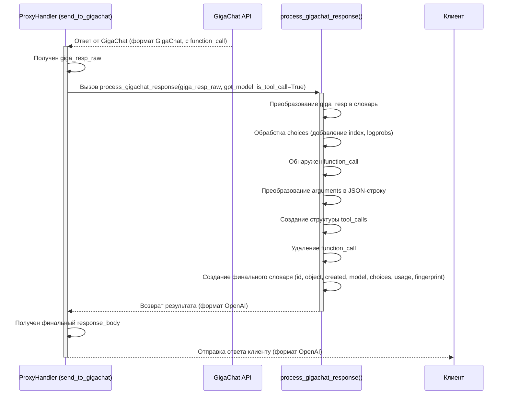

# Chapter 4: Преобразование ответа (GigaChat -> OpenAI)


В [предыдущей главе](03_преобразование_входящего_запроса__openai____gigachat__.md) мы узнали, как `gpt2giga` действует как опытный переводчик, адаптируя запрос от клиента (говорящего на "языке OpenAI") для GigaChat (понимающего свой "язык"). Мы разобрались, как метод `transform_input_data` изменяет структуру сообщений, параметры и даже обрабатывает изображения, чтобы GigaChat понял, что от него требуется.

Но что происходит потом? GigaChat обрабатывает запрос и отправляет ответ обратно. И вот новая задача: ответ от GigaChat тоже на его "языке"! Клиентское приложение, которое привыкло общаться с OpenAI, не поймет этот ответ. Нам нужен **обратный переводчик**.

Эта глава посвящена механизму, который берет ответ от GigaChat и переформатирует его обратно в структуру, которую ожидает клиент — то есть в формат OpenAI API. Это касается как стандартных ответов, так и потоковых данных (`stream`), обеспечивая полную совместимость.

## Зачем нужно преобразовывать ответ?

Представьте, что вы отправили письмо за границу с помощью переводчика. Переводчик перевел ваше письмо на язык получателя, и тот его понял. Но когда получатель написал ответ, он написал его на *своем* языке! Чтобы вы поняли ответ, тот же переводчик должен перевести его обратно на ваш язык.

Точно так же и с API:

*   **Ответ GigaChat:** Содержит информацию, но в своей специфической структуре. Например, информация об использованных токенах может называться иначе, или формат вызова функций может отличаться.
    *Пример (очень упрощенно):*
    ```json
    // Ответ от GigaChat (упрощенный)
    {
      "choices": [
        {
          "message": {
            "role": "assistant",
            "content": "Весна пришла, ручьи звенят!",
            "function_call": null // Или другая структура для функций
          },
          "finish_reason": "stop"
        }
      ],
      "usage": {
        "prompt_tokens": 15,
        "completion_tokens": 8,
        "total_tokens": 23
      }
      // Нет id, object, system_fingerprint в стиле OpenAI
    }
    ```
*   **Ожидаемый ответ клиента (формат OpenAI):** Клиент ждет ответ в строго определенном формате, с конкретными полями, такими как `id`, `object`, `created`, `model`, `system_fingerprint`, и специфической структурой внутри `choices` и `usage`.
    *Пример (очень упрощенно):*
    ```json
    // Ожидаемый клиентом формат OpenAI (упрощенный)
    {
      "id": "chatcmpl-...", // Уникальный ID
      "object": "chat.completion", // Тип объекта
      "created": 1677652288, // Время создания (Unix timestamp)
      "model": "gpt-3.5-turbo", // Модель, которую запрашивал клиент
      "choices": [
        {
          "index": 0, // Индекс варианта
          "message": {
            "role": "assistant",
            "content": "Весна пришла, ручьи звенят!",
            "tool_calls": null // Или другая структура для функций
          },
          "logprobs": null, // OpenAI ожидает это поле
          "finish_reason": "stop"
        }
      ],
      "usage": { // Структура использования токенов OpenAI
        "prompt_tokens": 15,
        "completion_tokens": 8,
        "total_tokens": 23
      },
      "system_fingerprint": "fp_..." // Идентификатор системы
    }
    ```

Задача обратного преобразователя — взять ответ GigaChat и аккуратно превратить его в формат, ожидаемый клиентом (OpenAI), не потеряв при этом важную информацию.

## Ключевые моменты обратного преобразования

"Обратный переводчик" в `gpt2giga` должен учитывать несколько основных различий:

1.  **Общая структура ответа:**
    *   **`id`:** OpenAI ожидает уникальный идентификатор ответа в формате `chatcmpl-...`. GigaChat его не предоставляет, поэтому `gpt2giga` генерирует его сам (`uuid.uuid4()`).
    *   **`object`:** Тип ответа. Для обычных ответов должен быть `chat.completion`, для потоковых — `chat.completion.chunk`. `gpt2giga` устанавливает правильное значение.
    *   **`created`:** Временная метка создания ответа (Unix timestamp). `gpt2giga` генерирует ее (`time.time()`).
    *   **`model`:** Имя модели. Клиент ожидает увидеть здесь то имя модели OpenAI, которое он указывал в запросе (например, `gpt-4`). `gpt2giga` запоминает это имя из запроса (мы видели это в `transform_input_data` в [прошлой главе](03_преобразование_входящего_запроса__openai____gigachat__.md)) и подставляет его сюда.
    *   **`system_fingerprint`:** Уникальный идентификатор системы, используемый OpenAI. `gpt2giga` генерирует его для совместимости.

2.  **Массив `choices` (Варианты ответа):**
    *   **`index`:** Индекс варианта ответа. OpenAI обычно начинает с 0. `gpt2giga` устанавливает его в 0.
    *   **`logprobs`:** Вероятности токенов. GigaChat не предоставляет эту информацию в стандартном API, поэтому `gpt2giga` устанавливает значение `null`.
    *   **`message` (или `delta` для потока):**
        *   **`refusal`:** GigaChat может вернуть поле `refusal` (отказ отвечать). OpenAI API его не имеет, `gpt2giga` может его удалять или игнорировать.
        *   **`function_call` vs `tool_calls`:** Это важное различие. GigaChat возвращает информацию о вызове функции в поле `function_call`, где `arguments` — это уже готовый словарь или список Python. OpenAI ожидает массив `tool_calls`, внутри которого есть объект с полями `id`, `type` (`"function"`) и `function` (содержащим `name` и `arguments`). Причем `arguments` в формате OpenAI должен быть **строкой** в формате JSON. `gpt2giga` выполняет это преобразование: создает структуру `tool_calls`, генерирует `id` для вызова и преобразует `arguments` из объекта Python в JSON-строку.
        *   **`content`:** Иногда GigaChat может вернуть пустой `content` (`""`) вместе с `function_call`. OpenAI часто ожидает `null` в таких случаях. `gpt2giga` может заменить `""` на `null`.

3.  **Объект `usage` (Использование токенов):**
    *   `gpt2giga` просто копирует значения `prompt_tokens`, `completion_tokens`, `total_tokens` из ответа GigaChat в структуру, ожидаемую OpenAI.
    *   Может добавлять дополнительные поля-заглушки (например, `prompt_tokens_details`), которые GigaChat не предоставляет, но которые могут ожидать некоторые клиенты.

4.  **Потоковые ответы (`stream`):**
    *   Когда клиент запросил `stream=True`, GigaChat возвращает последовательность "кусочков" (chunks). Каждый кусочек имеет похожую структуру, но основное изменение находится в поле `delta`, а не `message`.
    *   Преобразование для потока (`process_gigachat_stream`) очень похоже на обычное (`process_gigachat_response`), но оно применяется к каждому кусочку и работает с полем `delta`.
    *   Тип объекта устанавливается в `chat.completion.chunk`.
    *   Информация об `usage` может прийти только в *последнем* кусочке от GigaChat, и `gpt2giga` должен правильно ее обработать и включить в соответствующий `chunk`.

## Как это реализовано: функции `process_gigachat_response` и `process_gigachat_stream`

Задачу "обратного перевода" выполняют две функции, определенные прямо в файле `gpt2giga/__init__.py`:

*   `process_gigachat_response(giga_resp, gpt_model, is_tool_call)`: для обычных, непотоковых ответов.
*   `process_gigachat_stream(giga_resp, gpt_model, is_tool_call)`: для каждого кусочка потокового ответа.

Эти функции вызываются из методов `send_to_gigachat` и `send_to_gigachat_stream` внутри `ProxyHandler`, сразу после получения ответа от GigaChat API.

Давайте посмотрим на упрощенную структуру `process_gigachat_response`:

```python
# Файл: gpt2giga/__init__.py

import json
import time
import uuid
# ... другие импорты ...
from gigachat.models import ChatCompletion, ChatCompletionChunk # Типы ответов GigaChat

def process_gigachat_response(giga_resp: ChatCompletion, gpt_model: str, is_tool_call: bool = False) -> dict:
    """
    Обрабатывает ответ от GigaChat API и преобразует его в формат,
    ожидаемый клиентом (формат OpenAI).

    Args:
        giga_resp: Объект ответа от GigaChat.
        gpt_model: Имя модели OpenAI, которую запрашивал клиент.
        is_tool_call: Флаг, ожидает ли клиент ответ в формате tool_calls.

    Returns:
        Словарь в формате ответа OpenAI.
    """
    # 1. Преобразуем объект ответа GigaChat в словарь
    giga_dict = giga_resp.dict()

    # 2. Обрабатываем каждый вариант ответа в 'choices'
    for choice in giga_dict.get("choices", []):
        choice["index"] = 0     # Добавляем индекс 0
        choice["logprobs"] = None # Добавляем logprobs=None
        choice["message"].pop("refusal", None) # Удаляем поле refusal, если оно есть

        # 3. Преобразуем function_call в tool_calls, если необходимо
        if choice["message"].get("function_call"):
            func_call = choice["message"]["function_call"]
            # Преобразуем аргументы из Python-объекта в JSON-строку
            arguments_str = json.dumps(func_call.get("arguments", {}), ensure_ascii=False)

            # Создаем структуру tool_calls (OpenAI)
            if is_tool_call: # Если клиент использовал 'tools', а не 'functions'
                choice["message"]["tool_calls"] = [{
                    "id": f"call_{uuid.uuid4()}", # Генерируем ID для вызова
                    "type": "function",
                    "function": {
                        "name": func_call.get("name"),
                        "arguments": arguments_str,
                    }
                }]
                choice["message"].pop("function_call") # Удаляем исходное поле GigaChat
            else: # Если клиент использовал 'functions'
                # Оставляем function_call, но аргументы делаем строкой
                choice["message"]["function_call"]["arguments"] = arguments_str

            # Если content пустой, заменяем на None
            if choice["message"].get("content") == "":
                choice["message"]["content"] = None

    # 4. Собираем финальный словарь ответа в формате OpenAI
    result = {
        "id": "chatcmpl-" + str(uuid.uuid4()),        # Генерируем ID
        "object": "chat.completion",                 # Устанавливаем тип объекта
        "created": int(time.time()),                 # Текущее время
        "model": gpt_model,                          # Модель из запроса клиента
        "choices": giga_dict["choices"],             # Обновленные choices
        "usage": {                                   # Копируем и адаптируем usage
            "prompt_tokens": giga_dict["usage"]["prompt_tokens"],
            "completion_tokens": giga_dict["usage"]["completion_tokens"],
            "total_tokens": giga_dict["usage"]["total_tokens"],
            # Можно добавить поля-заглушки, если нужно
            # "prompt_tokens_details": {...},
        },
        "system_fingerprint": f"fp_{uuid.uuid4()}",  # Генерируем fingerprint
    }
    return result

# Функция process_gigachat_stream очень похожа, но работает с giga_resp типа ChatCompletionChunk
# и модифицирует поле 'delta' вместо 'message', а тип объекта ставит 'chat.completion.chunk'.
# Также она обрабатывает 'usage', если он приходит в последнем чанке.
```

**Объяснение кода:**

1.  **Входные данные:** Функция получает объект ответа от GigaChat (`giga_resp`), имя модели OpenAI, которое запросил клиент (`gpt_model`), и флаг `is_tool_call`, указывающий, использовал ли клиент параметр `tools` (требует `tool_calls` в ответе) или `functions` (требует `function_call`).
2.  **Преобразование в словарь:** Ответ GigaChat (`giga_resp`) преобразуется в обычный словарь Python (`giga_dict`) для удобства работы.
3.  **Обработка `choices`:** Код проходит по каждому варианту ответа (`choice`) в списке `choices`:
    *   Добавляет стандартные поля OpenAI: `index: 0` и `logprobs: null`.
    *   Удаляет специфичное для GigaChat поле `refusal`.
    *   **Обработка `function_call`:** Если GigaChat вернул вызов функции:
        *   Извлекает детали вызова (`func_call`).
        *   Преобразует `arguments` (которые у GigaChat являются Python-объектом) в JSON-строку (`arguments_str`) с помощью `json.dumps`.
        *   Если клиент ожидает `tool_calls` (`is_tool_call == True`), создает эту структуру: генерирует `id`, указывает `type: "function"` и вставляет `name` и `arguments_str` внутрь `function`. Затем удаляет исходное поле `function_call`.
        *   Если клиент ожидает `function_call`, то просто заменяет исходные `arguments` на их строковое представление `arguments_str`.
        *   Если `content` был пустой строкой, заменяет его на `None`.
4.  **Формирование финального ответа:** Создается новый словарь `result` со всеми полями, ожидаемыми клиентом в формате OpenAI:
    *   Генерируются `id`, `created`, `system_fingerprint`.
    *   Устанавливаются `object` и `model` (из `gpt_model`).
    *   Вставляются модифицированные `choices`.
    *   Копируются данные из `usage` GigaChat в структуру `usage` OpenAI.
5.  **Возврат:** Функция возвращает готовый словарь `result` в формате OpenAI.

Функция `process_gigachat_stream` работает аналогично, но для каждого "кусочка" потока (`ChatCompletionChunk`) и модифицирует поле `delta`.

## Пошаговый процесс преобразования ответа (Внутренний взгляд)

Давайте посмотрим, как `ProxyHandler` использует эти функции. Представим, GigaChat вернул ответ (непотоковый) с вызовом функции:



**Объяснение диаграммы:**

1.  `ProxyHandler` (внутри `send_to_gigachat`) получает ответ от `GigaChat API`.
2.  Он вызывает `process_gigachat_response`, передавая ей сырой ответ GigaChat, имя модели OpenAI, запрошенное клиентом, и флаг, указывающий, что клиент ждет `tool_calls`.
3.  `process_gigachat_response` выполняет все шаги преобразования: адаптирует `choices`, конвертирует `function_call` в `tool_calls` (включая перевод аргументов в JSON-строку), и собирает итоговый словарь с полями `id`, `object`, `created` и т.д.
4.  `process_gigachat_response` возвращает полностью преобразованный ответ в `ProxyHandler`.
5.  `ProxyHandler` отправляет этот ответ клиенту.

## Заглянем глубже в код преобразования

Рассмотрим ключевые фрагменты из `process_gigachat_response` и `process_gigachat_stream`.

**1. Генерация базовой структуры и обработка `choices` (непотоковый):**

```python
# Файл: gpt2giga/__init__.py (внутри process_gigachat_response)

def process_gigachat_response(giga_resp: ChatCompletion, gpt_model: str, is_tool_call: bool = False) -> dict:
    giga_dict = giga_resp.dict() # Ответ GigaChat как словарь

    for choice in giga_dict.get("choices", []):
        choice["index"] = 0     # Стандартный индекс
        choice["logprobs"] = None # Стандартное поле logprobs
        choice["message"].pop("refusal", None) # Удаляем специфичное поле
        # ... обработка function_call/tool_calls ...

    # Собираем финальный ответ
    result = {
        "id": "chatcmpl-" + str(uuid.uuid4()), # Генерация ID
        "object": "chat.completion",          # Тип объекта
        "created": int(time.time()),          # Время создания
        "model": gpt_model,                   # Имя модели для клиента
        "choices": giga_dict["choices"],      # Модифицированные choices
        "usage": { /* ... копирование usage ... */ },
        "system_fingerprint": f"fp_{uuid.uuid4()}", # Генерация fingerprint
    }
    return result
```

Этот фрагмент показывает, как добавляются стандартные поля (`index`, `logprobs`) и как формируется общая структура ответа (`id`, `object`, `created` и т.д.).

**2. Преобразование `function_call` в `tool_calls` (непотоковый):**

```python
# Файл: gpt2giga/__init__.py (внутри цикла for choice in ... в process_gigachat_response)

        if choice["message"].get("function_call"):
            func_call = choice["message"]["function_call"]
            # Преобразуем Python объект аргументов в JSON строку
            arguments_str = json.dumps(func_call.get("arguments", {}), ensure_ascii=False)

            if is_tool_call: # Если клиент ждет tool_calls
                choice["message"]["tool_calls"] = [{
                    "id": f"call_{uuid.uuid4()}", # Уникальный ID для этого вызова
                    "type": "function",
                    "function": {
                        "name": func_call.get("name"),
                        "arguments": arguments_str, # Используем JSON-строку
                    }
                }]
                choice["message"].pop("function_call") # Удаляем старое поле
            else: # Если клиент ждет function_call (старый формат)
                choice["message"]["function_call"]["arguments"] = arguments_str # Просто обновляем аргументы

            if choice["message"].get("content") == "":
                choice["message"]["content"] = None # Заменяем "" на null
```

Здесь видна логика преобразования: получение `function_call`, преобразование `arguments` в строку, и создание структуры `tool_calls` с новым `id`, если это необходимо (`is_tool_call == True`).

**3. Обработка потокового ответа (`delta`):**

```python
# Файл: gpt2giga/__init__.py (внутри process_gigachat_stream)

def process_gigachat_stream(giga_resp: ChatCompletionChunk, gpt_model: str, is_tool_call: bool = False) -> dict:
    giga_dict = giga_resp.dict() # Кусочек ответа GigaChat как словарь

    for choice in giga_dict.get("choices", []):
        choice["index"] = 0
        choice["logprobs"] = None
        # Работаем с полем 'delta' вместо 'message'
        if choice.get("delta", {}).get("function_call"):
            func_call = choice["delta"]["function_call"]
            # Преобразуем аргументы в JSON-строку
            arguments_str = json.dumps(func_call.get("arguments", {}), ensure_ascii=False)

            if is_tool_call: # Если клиент ждет tool_calls
                 choice["delta"]["tool_calls"] = [{
                    "id": f"call_{uuid.uuid4()}",
                    "type": "function",
                    "function": {
                        "name": func_call.get("name"),
                        "arguments": arguments_str,
                    }
                }]
                 choice["delta"].pop("function_call") # Удаляем старое поле из delta
            else:
                 choice["delta"]["function_call"]["arguments"] = arguments_str

            if choice["delta"].get("content") == "":
                choice["delta"]["content"] = None

    # Обработка 'usage' (может прийти в последнем чанке)
    usage = None
    if giga_dict.get("usage", None) is not None:
        usage = { /* ... копирование usage ... */ }

    # Собираем кусочек ответа в формате OpenAI
    result = {
        "id": "chatcmpl-" + str(uuid.uuid4()),
        "object": "chat.completion.chunk", # Тип объекта для потока
        "created": int(time.time()),
        "model": gpt_model,
        "choices": giga_dict["choices"], # Модифицированные choices с delta
        "usage": usage, # Добавляем usage, если он есть в этом чанке
        "system_fingerprint": f"fp_{uuid.uuid4()}",
    }
    return result
```

Этот код очень похож на непотоковый вариант, но ключевые отличия:
*   Работает с `ChatCompletionChunk`.
*   Модифицирует поле `delta`, а не `message`.
*   Устанавливает `object` в `chat.completion.chunk`.
*   Обрабатывает `usage`, который может появиться только в одном из чанков (обычно последнем).

## Заключение

В этой главе мы завершили цикл "перевода", рассмотрев, как `gpt2giga` преобразует ответ от GigaChat обратно в формат, понятный клиенту OpenAI. Мы узнали, что:

*   Обратное преобразование необходимо, так как форматы ответов GigaChat и OpenAI различаются.
*   `gpt2giga` использует функции `process_gigachat_response` (для обычных ответов) и `process_gigachat_stream` (для потоковых) для выполнения этого "обратного перевода".
*   Основные шаги преобразования включают:
    *   Генерацию стандартных полей OpenAI (`id`, `object`, `created`, `model`, `system_fingerprint`).
    *   Адаптацию массива `choices` (добавление `index`, `logprobs`, удаление `refusal`).
    *   Корректное преобразование вызовов функций (`function_call` GigaChat -> `tool_calls` или обновленный `function_call` OpenAI), включая перевод аргументов в JSON-строку.
    *   Копирование и адаптацию данных об использовании токенов (`usage`).
*   Для потоковых ответов преобразование применяется к полю `delta` каждого "кусочка".

Теперь, когда мы понимаем полный цикл обработки текстовых запросов (запрос OpenAI -> запрос GigaChat -> ответ GigaChat -> ответ OpenAI), мы готовы рассмотреть особую часть этого процесса — как `gpt2giga` работает с изображениями, которые могут быть частью запроса.

**Следующая глава:** [Обработка изображений](05_обработка_изображений_.md)

---

Generated by [AI Codebase Knowledge Builder](https://github.com/The-Pocket/Tutorial-Codebase-Knowledge)