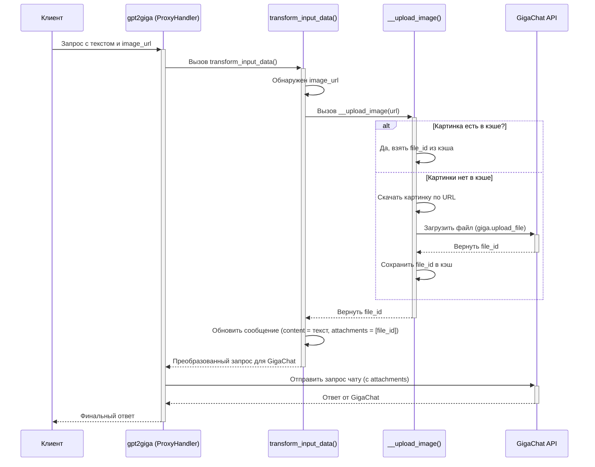

# Chapter 5: Обработка изображений


В [предыдущей главе](04_преобразование_ответа__gigachat____openai__.md) мы разобрались, как `gpt2giga` переводит ответ от GigaChat обратно на "язык" OpenAI, чтобы ваше приложение его поняло. Мы завершили основной цикл обработки текстовых запросов. Но что, если мы хотим не просто поговорить с ИИ, а показать ему картинку и спросить о ней?

Современные модели, такие как GigaChat, умеют "видеть" и анализировать изображения. Клиенты, совместимые с OpenAI Vision API, позволяют отправлять картинки вместе с текстом. Эта глава посвящена тому, как `gpt2giga` обрабатывает такие визуальные запросы.

## Зачем нужна обработка изображений? Какую проблему она решает?

Представьте, вы используете приложение для чата с ИИ, которое умеет работать с OpenAI. Вы хотите отправить фотографию вашего кота и спросить: "Что делает этот кот?". Ваше приложение, скорее всего, отправит запрос примерно такого вида:

```json
// Пример запроса от клиента (формат OpenAI Vision)
{
  "model": "gpt-4-vision-preview", // Модель с поддержкой зрения
  "messages": [
    {
      "role": "user",
      "content": [ // Контент как список: текст + картинка
        {"type": "text", "text": "Что делает этот кот?"},
        {"type": "image_url", "image_url": {"url": "https://example.com/my_cat.jpg"}}
        // Или картинка может быть закодирована прямо здесь (base64)
        // {"type": "image_url", "image_url": {"url": "data:image/jpeg;base64,/9j/..."}}
      ]
    }
  ]
  // ... другие параметры ...
}
```

Проблема в том, что GigaChat ожидает изображения в другом формате. Он не может просто взять URL из текста сообщения. Ему нужно, чтобы картинка была сначала **загружена** на его серверы, и только потом, при отправке сообщения, нужно указать **идентификатор (ID)** этой загруженной картинки.

Вот тут-то и вступает в игру `gpt2giga`! Он работает как **фотоателье**:
1.  **Принимает фотографию:** Он видит URL картинки (или строку base64) в запросе от клиента.
2.  **Обрабатывает ее:** Скачивает картинку по URL (или декодирует base64) и загружает ее на сервер GigaChat.
3.  **Присваивает номер заказа:** GigaChat возвращает уникальный ID для загруженного файла.
4.  **Готовит запрос для GigaChat:** `gpt2giga` изменяет исходное сообщение: убирает из него URL картинки, оставляя только текст, и добавляет специальное поле `attachments` со списком ID загруженных файлов.
5.  **Хранит в архиве (кэш):** Чтобы не загружать одну и ту же картинку много раз, `gpt2giga` запоминает ID для каждой уникальной картинки (по ее URL или содержимому). Если вы отправите ту же картинку снова, он просто возьмет ID из своего архива (кэша).

Без этой обработки GigaChat просто не "увидел" бы картинку, которую вы ему отправили.

## Ключевые моменты обработки изображений

Давайте чуть подробнее разберем шаги, которые выполняет `gpt2giga`:

*   **Обнаружение изображений:** Когда `gpt2giga` получает запрос (в методе `transform_input_data`, который мы обсуждали в главе [Преобразование входящего запроса (OpenAI -> GigaChat)](03_преобразование_входящего_запроса__openai____gigachat__.md)), он проверяет поле `content` в каждом сообщении. Если `content` — это список, он ищет в нем элементы с типом `image_url`.
*   **Получение данных изображения:**
    *   Если указан `url`, начинающийся с `http://` или `https://`, `gpt2giga` скачивает изображение по этой ссылке.
    *   Если `url` начинается с `data:image/...;base64,`, это значит, что изображение закодировано прямо в строке (формат base64). `gpt2giga` декодирует эту строку, чтобы получить бинарные данные картинки.
*   **Загрузка в GigaChat:** Используя полученные данные, `gpt2giga` вызывает специальный метод `giga.upload_file(...)` из библиотеки GigaChat SDK. Этот метод отправляет картинку на сервер GigaChat.
*   **Получение ID файла:** В ответ на успешную загрузку GigaChat API возвращает объект `File`, содержащий уникальный `id` загруженного файла.
*   **Кэширование:** Перед загрузкой `gpt2giga` вычисляет "отпечаток" (хэш) URL или base64-строки картинки. Он проверяет, нет ли уже ID для этого отпечатка в его внутреннем словаре-кэше (`self.image_cache`). Если есть — он сразу берет ID из кэша, пропуская скачивание и загрузку. Если нет — он загружает картинку и сохраняет полученный ID в кэш.
*   **Модификация сообщения:** `transform_input_data` пересобирает сообщение для GigaChat:
    *   Поле `content` будет содержать только объединенный текст из всех текстовых частей исходного сообщения.
    *   Появится новое поле `attachments`, содержащее список ID всех загруженных (или взятых из кэша) изображений для этого сообщения. GigaChat позволяет прикрепить до 2 изображений к одному сообщению и не более 10 на весь диалог. `gpt2giga` учитывает эти ограничения.

**Важно:** Эта функция работает, только если при запуске сервера `gpt2giga` был указан флаг `--enable-images`. Без него изображения в запросах будут просто проигнорированы.

## Как это работает на практике?

Давайте вернемся к нашему примеру с котом.

**Шаг 1: Клиент отправляет запрос (формат OpenAI)**

```json
{
  "model": "gpt-4-vision-preview",
  "messages": [
    {
      "role": "user",
      "content": [
        {"type": "text", "text": "Что делает этот кот?"},
        {"type": "image_url", "image_url": {"url": "https://example.com/my_cat.jpg"}}
      ]
    }
  ]
}
```

**Шаг 2: `gpt2giga` обрабатывает запрос в `transform_input_data`**

1.  Обнаруживает, что `content` - это список.
2.  Находит текстовую часть: "Что делает этот кот?".
3.  Находит часть с `image_url`: `https://example.com/my_cat.jpg`.
4.  Проверяет, включена ли опция `--enable-images`. Допустим, да.
5.  Вычисляет хэш от `"https://example.com/my_cat.jpg"`.
6.  Проверяет кэш `self.image_cache`. Допустим, картинка новая, ее там нет.
7.  Вызывает внутренний метод `self.__upload_image("https://example.com/my_cat.jpg")`.
8.  `__upload_image` скачивает картинку по URL.
9.  `__upload_image` вызывает `self.giga.upload_file(...)`, передавая данные картинки.
10. GigaChat API возвращает ID, например, `file_abc123xyz`.
11. `__upload_image` сохраняет ID в кэш: `self.image_cache[<хэш_URL>] = 'file_abc123xyz'`.
12. `__upload_image` возвращает `file_abc123xyz` в `transform_input_data`.
13. `transform_input_data` формирует новое сообщение для GigaChat.

**Шаг 3: Запрос преобразуется в формат GigaChat**

```python
# Пример объекта Chat, который будет отправлен в GigaChat
Chat(
  messages=[
    Messages(
      role='user',
      content='Что делает этот кот?', # Только текст
      attachments=['file_abc123xyz'] # ID файла в attachments
    )
  ],
  # ... другие параметры GigaChat ...
)
```

Теперь GigaChat получит и текст, и ссылку на предварительно загруженное изображение, и сможет ответить на вопрос "Что делает этот кот?".

## Внутренний механизм: как это реализовано

Давайте посмотрим на диаграмму процесса и заглянем в код.

**Диаграмма обработки изображения:**



**Заглянем в код**

Основная логика находится в двух местах файла `gpt2giga/__init__.py`:

1.  **Метод `transform_input_data`:** Он определяет, что в сообщении есть картинка, и вызывает загрузчик.
2.  **Метод `__upload_image`:** Он непосредственно занимается скачиванием/декодированием, кэшированием и загрузкой в GigaChat.

**Код в `transform_input_data` (упрощенно):**

```python
# Файл: gpt2giga/__init__.py (внутри класса ProxyHandler)

    def transform_input_data(self, data: dict) -> Tuple[Chat, Optional[str]]:
        # ... (пропуск обработки модели, температуры, tools) ...

        messages = data.get("messages", [])
        find_images_flag = False # Флаг, что были картинки
        attachment_count = 0     # Общий счетчик картинок

        for i, message in enumerate(messages):
            # ... (пропуск обработки ролей, tool_calls) ...

            # Если content - это список (может содержать картинки)
            if isinstance(message["content"], list):
                texts = []         # Сюда соберем текст
                attachments = []   # Сюда соберем ID файлов

                # Проходим по частям контента
                for content_part in message["content"]:
                    if content_part.get("type") == "text":
                        texts.append(content_part.get("text", ""))
                    # Если это картинка и включена обработка картинок
                    elif content_part.get("type") == "image_url" and self.enable_images:
                        find_images_flag = True
                        image_source = content_part.get("image_url", {}).get("url")
                        if image_source:
                            # Вызываем метод загрузки картинки
                            file_id = self.__upload_image(image_source)
                            if file_id is not None:
                                attachments.append(file_id) # Добавляем ID в список
                                attachment_count += 1

                # Проверка лимита GigaChat (не более 2 на сообщение)
                if len(attachments) > 2:
                    print('GigaChat может обработать не более 2 изображений в сообщении! Обрезаем.')
                    attachments = attachments[:2]

                # Заменяем исходный content на строку текста
                message["content"] = "\n".join(texts)
                # Добавляем поле attachments с ID файлов
                message["attachments"] = attachments
            # Если content не список, но был найден флаг картинок ранее - очищаем content, т.к. GigaChat не поддерживает смешанные сообщения без list content
            elif find_images_flag:
                message["content"] = ""

        # Предупреждение, если картинки были, но опция выключена
        if find_images_flag and not self.enable_images:
            print('Прокси получил чат с изображениями, но флаг --enable-images выключен.')

        # Проверка общего лимита картинок (не более 10 на диалог)
        # ... (код удаления лишних attachments, если attachment_count > 10) ...

        chat = Chat.parse_obj(data) # Создаем объект Chat из измененных данных
        return chat, gpt_model
```

**Объяснение:** Этот код внутри `transform_input_data` проверяет, является ли `content` списком. Если да, он проходит по его элементам. Для текста — добавляет в `texts`. Для `image_url` — вызывает `self.__upload_image` (если опция `--enable-images` активна) и добавляет полученный ID в `attachments`. В конце он заменяет исходный `content` на объединенный текст и добавляет поле `attachments`.

**Метод `__upload_image` (упрощенно):**

```python
# Файл: gpt2giga/__init__.py (внутри класса ProxyHandler)

    def __upload_image(self, image_url: str) -> Optional[str]:
        """Загружает изображение по URL или из base64 и возвращает file_id."""
        # Вычисляем хэш от URL/base64 строки для использования как ключ кэша
        hashed = hashlib.sha256(image_url.encode()).hexdigest()

        # 1. Проверяем кэш
        if hashed in self.image_cache:
            return self.image_cache[hashed] # Возвращаем ID из кэша

        # 2. Если в кэше нет, получаем данные картинки
        content_bytes = None
        # Проверяем, это base64 строка? (data:image/jpeg;base64,...)
        base64_matches = re.search(r"data:(.+);base64,(.+)", image_url)

        if base64_matches:
            # Декодируем base64
            try:
                content_bytes = base64.b64decode(base64_matches.group(2))
            except Exception as e:
                print(f'Ошибка декодирования base64: {e}')
                return None
        else:
            # Если не base64, считаем что это URL и скачиваем
            try:
                # Используем httpx для скачивания (умеет работать с http/https)
                response = httpx.get(image_url, timeout=30)
                response.raise_for_status() # Проверяем на ошибки HTTP (4xx, 5xx)
                # Проверяем, что скачали именно картинку
                content_type = response.headers.get('content-type', "")
                if not content_type.startswith("image/"):
                    print(f'URL не указывает на изображение: {content_type}')
                    return None
                content_bytes = response.content
            except Exception as e:
                print(f'Ошибка загрузки изображения по URL {image_url}: {e}')
                return None

        # 3. Если данные получены, загружаем в GigaChat
        if content_bytes:
            try:
                # Открываем картинку с помощью Pillow, конвертируем в RGB
                # и сохраняем в буфер памяти в формате JPEG
                image = Image.open(io.BytesIO(content_bytes)).convert("RGB")
                buf = io.BytesIO()
                image.save(buf, format='JPEG')
                buf.seek(0) # Перематываем буфер в начало

                # Вызываем метод SDK для загрузки файла
                file_info = self.giga.upload_file(
                    file=(f"{uuid.uuid4()}.jpg", buf) # Имя файла и буфер с данными
                )

                # 4. Сохраняем ID в кэш и возвращаем его
                self.image_cache[hashed] = file_info.id_
                return file_info.id_
            except Exception as e:
                print(f'Ошибка загрузки файла в GigaChat: {e}')
                return None

        return None # Если не удалось получить данные или загрузить
```

**Объяснение:**
1.  **Кэширование:** Сначала вычисляется хэш от `image_url` (будь то URL или base64 строка). Если такой хэш уже есть в `self.image_cache`, функция сразу возвращает сохраненный `file_id`.
2.  **Получение данных:** Если в кэше нет, код проверяет, является ли `image_url` строкой base64. Если да - декодирует ее. Если нет - скачивает по URL с помощью `httpx`. На этом этапе выполняются проверки на ошибки сети и типа контента.
3.  **Загрузка:** Если данные изображения (`content_bytes`) успешно получены, код использует библиотеку `Pillow` (PIL) для обработки изображения (конвертация в RGB, сохранение в JPEG в памяти) и затем вызывает `self.giga.upload_file`, передавая ему уникальное имя файла и байты изображения.
4.  **Возврат и кэширование:** Если загрузка прошла успешно, GigaChat возвращает информацию о файле (`file_info`). Код извлекает `file_info.id_`, сохраняет его в кэш `self.image_cache` по ключу `hashed` и возвращает этот `id`. В случае любой ошибки возвращается `None`.

Этот механизм позволяет `gpt2giga` прозрачно для пользователя обрабатывать изображения, обеспечивая совместимость между OpenAI Vision API и GigaChat API.

## Заключение

В этой главе мы погрузились в увлекательный мир обработки изображений в `gpt2giga`. Мы узнали:

*   Зачем нужна обработка изображений: чтобы подружить формат запросов с картинками OpenAI Vision API и требования GigaChat API к загрузке файлов.
*   Как `gpt2giga` работает как "фотоателье": обнаруживает картинки (URL или base64), скачивает/декодирует их, загружает в GigaChat для получения ID файла.
*   Как модифицируется сообщение: текст остается в `content`, а ID файлов помещаются в `attachments`.
*   О роли кэширования (`self.image_cache`), которое экономит время и ресурсы, избегая повторных загрузок одних и тех же изображений.
*   Что вся эта магия происходит в методах `transform_input_data` и `__upload_image` и активируется флагом `--enable-images`.

Мы рассмотрели все ключевые компоненты `gpt2giga`: маршрутизацию, обработку запросов, преобразование данных туда и обратно, и даже работу с изображениями. Теперь остался последний шаг: узнать, как все это запустить и настроить!

**Следующая глава:** [Запуск и конфигурация сервера](06_запуск_и_конфигурация_сервера_.md)

---

Generated by [AI Codebase Knowledge Builder](https://github.com/The-Pocket/Tutorial-Codebase-Knowledge)