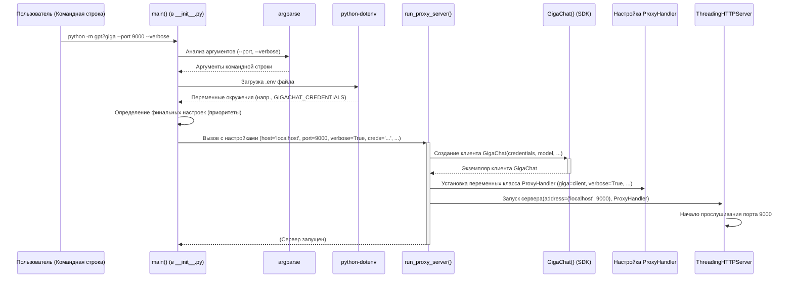

# Chapter 6: Запуск и конфигурация сервера


Поздравляем! Мы прошли долгий путь и разобрались со всеми основными механизмами `gpt2giga`. В [предыдущей главе](05_обработка_изображений_.md) мы узнали, как наш прокси-сервер умеет работать даже с изображениями, загружая их в GigaChat и подготавливая запрос нужным образом. Мы понимаем, как происходит маршрутизация, преобразование запросов и ответов.

Теперь, когда мы знаем, *как* устроен `gpt2giga` изнутри, пришло время научиться самому главному: как его **запустить** и **настроить** под свои нужды. Ведь без этого наш мощный инструмент останется просто набором кода.

## Мотивация: Зачем нужна настройка?

Представьте, что `gpt2giga` — это ресторан, который мы построили. Мы знаем, как работает кухня ([Преобразование запроса](03_преобразование_входящего_запроса__openai____gigachat__.md) и [ответа](04_преобразование_ответа__gigachat____openai__.md)), как официанты принимают заказы ([Обработчик запросов](02_обработчик_запросов_прокси__proxyhandler__.md)), и даже как обрабатывать особые пожелания (например, [обработка изображений](05_обработка_изображений_.md)). Но чтобы ресторан открылся, нужно решить несколько организационных вопросов:

1.  **Где он будет находиться?** (На каком сетевом адресе и порту будет работать сервер?)
2.  **Как сотрудники попадут на кухню GigaChat?** (Какие учетные данные использовать для доступа к GigaChat API?)
3.  **Какие будут особые правила работы?** (Нужно ли показывать подробные логи? Разрешать ли клиентам выбирать модель GigaChat? Включить ли поддержку картинок?)

Именно для ответов на эти вопросы и нужна **конфигурация**. Она позволяет нам указать `gpt2giga`, как именно он должен работать при запуске.

## Ключевые понятия конфигурации

Настроить `gpt2giga` можно двумя основными способами, которые часто используются вместе:

1.  **Командная строка (Command Line):** Это основной способ запуска `gpt2giga`. Мы открываем терминал (командную строку) и пишем команду, чтобы запустить наш скрипт.
2.  **Аргументы командной строки (Command-Line Arguments):** Это специальные "ключи" или "флаги", которые мы добавляем к команде запуска, чтобы изменить поведение сервера *именно для этого запуска*. Например, указать другой порт или включить режим отладки.
3.  **Файл `.env` (Environment Variables):** Это текстовый файл с именем `.env`, который лежит в той же папке, откуда мы запускаем `gpt2giga`. В нем можно прописать настройки, которые будут использоваться по умолчанию. Это особенно удобно для хранения **секретных данных**, таких как учетные данные GigaChat, чтобы не писать их каждый раз в командной строке.

**Приоритет настроек:** Что если настройка указана и в командной строке, и в `.env`? `gpt2giga` следует простому правилу:
1.  **Аргументы командной строки** имеют **наивысший** приоритет.
2.  Если аргумент не указан, используется значение из **файла `.env`**.
3.  Если и там нет, используется **значение по умолчанию**, зашитое в коде.

### Основные параметры конфигурации

Давайте рассмотрим самые важные настройки, которые вы можете менять:

*   **`--host`** (и переменная `PROXY_HOST` в `.env`): Сетевой адрес, на котором сервер будет принимать запросы. По умолчанию обычно `localhost` (или `127.0.0.1`), что означает "только на этом компьютере". Если вы хотите, чтобы к серверу могли подключаться другие устройства в вашей сети, можно указать `0.0.0.0`.
    *   *Аналогия:* Адрес улицы, где находится ресторан.
*   **`--port`** (и переменная `PROXY_PORT` в `.env`): Номер "двери" (порта) на указанном адресе, через которую будут приходить запросы. По умолчанию `8090`.
    *   *Аналогия:* Номер дома на улице.
*   **Учетные данные GigaChat (Credentials):** Самый важный параметр! Это "ключ" для доступа к API GigaChat. **Рекомендуемый способ** — прописать их в файле `.env`. Есть несколько вариантов:
    *   `GIGACHAT_CREDENTIALS`: Основной способ, строка с авторизационными данными клиента (Client Secret), полученными при регистрации в GigaChat.
    *   `GIGACHAT_ACCESS_TOKEN`: Если у вас уже есть временный токен доступа.
    *   `GIGACHAT_USER` и `GIGACHAT_PASSWORD`: Имя пользователя и пароль (менее рекомендуется).
    *   *Аналогия:* Ключи от кухни GigaChat.
*   **`--verbose`** (и `GPT2GIGA_VERBOSE=True` в `.env`): Включает подробный вывод информации (логгирование) о том, что происходит внутри сервера — какие запросы приходят, какие ответы отправляются. Очень полезно для отладки.
    *   *Аналогия:* Сделать кухню ресторана открытой для посетителей, чтобы видеть весь процесс.
*   **`--pass-model`** (и `GPT2GIGA_PASS_MODEL=True` в `.env`): Позволяет приложению-клиенту самому указывать, какую модель GigaChat использовать (например, `GigaChat-Pro`, `GigaChat-Lite`). Если выключено, `gpt2giga` будет использовать модель, указанную при запуске сервера или по умолчанию.
*   **`--pass-token`** (и `GPT2GIGA_PASS_TOKEN=True` в `.env`): Позволяет приложению-клиенту передавать свои собственные учетные данные GigaChat в заголовке `Authorization`. Это полезно в сценариях, где разные пользователи должны использовать свои ключи. Если выключено, используется один ключ, настроенный для всего сервера.
*   **`--enable-images`** (и `GPT2GIGA_ENABLE_IMAGES=True` в `.env`): Включает функцию обработки изображений, которую мы рассматривали в [Главе 5](05_обработка_изображений_.md). Без этого флага картинки в запросах будут игнорироваться.
*   **`--model`** (и `GIGACHAT_MODEL` в `.env`): Указывает, какую модель GigaChat использовать по умолчанию, если `--pass-model` выключен или клиент не указал модель.
*   **`--timeout`** (и `GPT2GIGA_TIMEOUT` в `.env`): Сколько секунд ждать ответа от GigaChat перед тем, как считать запрос неудавшимся. По умолчанию 600 секунд (10 минут).
*   **`--verify-ssl-certs`** (и `GIGACHAT_VERIFY_SSL_CERTS=True` в `.env`): Проверять ли SSL-сертификаты сервера GigaChat. Обычно должно быть включено (значение `True`) для безопасности. Отключать (`False`) стоит только в особых случаях (например, при тестировании с самоподписанными сертификатами). По умолчанию `False` для совместимости со старыми версиями GigaChat API (до изменения адреса на `gigachat.devices.sberbank.ru`).

## Как запустить сервер (Практические примеры)

Запуск `gpt2giga` происходит из командной строки (терминала). Убедитесь, что вы находитесь в папке вашего проекта `gpt2giga` или что он установлен как пакет Python.

**1. Самый простой запуск (с использованием `.env`)**

Сначала создайте в корневой папке проекта файл с именем `.env` (именно так, с точкой в начале) и добавьте в него ваши учетные данные:

```dotenv
# Файл: .env
GIGACHAT_CREDENTIALS=ВАШИ_УЧЕТНЫЕ_ДАННЫЕ_ОТ_GIGACHAT_API
# Можно добавить и другие настройки, например:
# PROXY_PORT=9000
# GPT2GIGA_VERBOSE=True
# GPT2GIGA_ENABLE_IMAGES=True
```

Замените `ВАШИ_УЧЕТНЫЕ_ДАННЫЕ_ОТ_GIGACHAT_API` на ваш реальный ключ. Теперь запустите сервер командой:

```bash
python -m gpt2giga
```

Сервер запустится на адресе `localhost` и порту `8090` (или на порту, указанном в `.env`), используя учетные данные из `.env`. Вы увидите сообщение:

```
Serving HTTP proxy on http://localhost:8090
```

Теперь вы можете направлять запросы от ваших OpenAI-совместимых приложений на `http://localhost:8090`.

**2. Запуск с указанием другого порта**

Если порт 8090 занят или вы хотите использовать другой:

```bash
python -m gpt2giga --port 9999
```

Сервер запустится на `http://localhost:9999`. Этот аргумент `--port 9999` переопределит значение `PROXY_PORT` из `.env`, если оно там было.

**3. Запуск с подробным логгированием**

Для отладки полезно видеть, что происходит:

```bash
python -m gpt2giga --verbose
```

Теперь в консоли будет выводиться гораздо больше информации о входящих запросах и ответах.

**4. Запуск с передачей модели клиентом и включенными картинками**

```bash
python -m gpt2giga --pass-model --enable-images
```

Теперь клиенты смогут указывать модель GigaChat в своих запросах, и сервер будет обрабатывать изображения.

**5. Указание пути к файлу `.env`**

Если ваш `.env` файл находится не в текущей папке, вы можете указать путь к нему:

```bash
python -m gpt2giga --env-path /путь/к/вашему/файлу/.env
```

## Как это работает под капотом (Внутренняя реализация)

Когда вы выполняете команду `python -m gpt2giga`, происходит несколько шагов внутри кода `gpt2giga`. За это отвечают в основном две функции в файле `gpt2giga/__init__.py`: `main()` и `run_proxy_server()`.

**Общий обзор:**

Функция `main()` — это точка входа, "стартер" нашего сервера. Она отвечает за сбор всех настроек из разных источников. Функция `run_proxy_server()` — это "менеджер", который берет эти настройки и непосредственно запускает веб-сервер с нужными параметрами.

**Шаг за шагом:**

1.  **Запуск `main()`:** Python находит и запускает функцию `main()`.
2.  **Чтение аргументов:** `main()` использует стандартную библиотеку `argparse` для анализа аргументов, которые вы передали в командной строке (например, `--port 9000`).
3.  **Загрузка `.env`:** `main()` использует библиотеку `python-dotenv` для поиска и загрузки переменных из файла `.env`.
4.  **Определение настроек:** `main()` собирает все настройки воедино. Для каждого параметра она проверяет: есть ли он в аргументах командной строки? Если да — берет его. Если нет — проверяет, есть ли он в переменных окружения (загруженных из `.env`). Если да — берет его. Если нет — использует значение по умолчанию.
5.  **Вызов `run_proxy_server()`:** `main()` вызывает `run_proxy_server()`, передавая ей все окончательно определенные настройки (хост, порт, учетные данные, флаги `verbose`, `pass_model` и т.д.).
6.  **Инициализация GigaChat:** `run_proxy_server()` создает основной объект для общения с GigaChat (`GigaChat(...)`), передавая ему учетные данные, URL API, таймаут и другие связанные параметры.
7.  **Настройка `ProxyHandler`:** `run_proxy_server()` "сообщает" классу `ProxyHandler` (который мы изучали в [Главе 2](02_обработчик_запросов_прокси__proxyhandler__.md)) все необходимые настройки. Она делает это, устанавливая *переменные класса* `ProxyHandler` (например, `ProxyHandler.giga = созданный_объект_GigaChat`, `ProxyHandler.verbose = True` и т.д.). Когда будет создан новый экземпляр `ProxyHandler` для обработки входящего запроса, он скопирует эти значения из переменных класса.
8.  **Запуск веб-сервера:** `run_proxy_server()` создает и запускает сам HTTP-сервер (`ThreadingHTTPServer`), указывая ему, на каком адресе и порту слушать, и какой класс использовать для обработки запросов (`ProxyHandler`). С этого момента сервер готов принимать запросы.

**Диаграмма запуска:**



### Погружение в код

Давайте посмотрим на упрощенные фрагменты кода `main()` и `run_proxy_server()`.

**Функция `main()` (упрощенно):**

```python
# Файл: gpt2giga/__init__.py

import argparse
import os
from dotenv import find_dotenv, load_dotenv
# ... другие импорты ...

def main():
    # 1. Определяем аргументы командной строки
    parser = argparse.ArgumentParser(description="Прокси Gpt2Giga")
    parser.add_argument("--host", type=str, default=None, help="Хост")
    parser.add_argument("--port", type=int, default=None, help="Порт")
    parser.add_argument("--verbose", action="store_true", default=None, help="Подробный лог")
    parser.add_argument("--pass-model", action="store_true", default=None)
    parser.add_argument("--pass-token", action="store_true", default=None)
    parser.add_argument("--enable-images", action="store_true", default=None)
    # ... другие аргументы ...
    parser.add_argument("--env-path", type=str, default=None, help="Путь к .env файлу")
    args = parser.parse_args() # Читаем аргументы, переданные при запуске

    # 2. Загружаем переменные из .env файла
    env_path = find_dotenv(args.env_path if args.env_path else f"{os.getcwd()}/.env")
    load_dotenv(env_path)

    # 3. Определяем финальные настройки с учетом приоритетов
    defaults = {
        "host": os.getenv("PROXY_HOST", "localhost"), # Сначала .env, потом 'localhost'
        "port": int(os.getenv("PROXY_PORT", "8090")), # Сначала .env, потом 8090
        "verbose": os.getenv("GPT2GIGA_VERBOSE", "False") != "False",
        "pass_model": os.getenv("GPT2GIGA_PASS_MODEL", "False") != "False",
        "pass_token": os.getenv("GPT2GIGA_PASS_TOKEN", "False") != "False",
        "enable_images": os.getenv("GPT2GIGA_ENABLE_IMAGES", "False") != "False",
        # ... другие настройки по умолчанию из os.getenv() ...
        "verify_ssl_certs": os.getenv("GIGACHAT_VERIFY_SSL_CERTS", "False") != "False",
    }
    # Перезаписываем значения из defaults аргументами командной строки, если они были указаны
    for key, value in defaults.items():
        if getattr(args, key) is None: # Если аргумент не был задан в командной строке...
            setattr(args, key, value) # ...берем значение из defaults (которое взято из .env или стандартное)

    # 4. Вызываем функцию запуска сервера с финальными настройками
    run_proxy_server(
        host=args.host,
        port=args.port,
        verbose=args.verbose,
        pass_model=args.pass_model,
        pass_token=args.pass_token,
        enable_images=args.enable_images,
        # ... передаем остальные настройки ...
        verify_ssl_certs=args.verify_ssl_certs,
    )

# ... (остальной код, включая run_proxy_server, ProxyHandler и т.д.) ...

# Этот блок гарантирует, что main() запустится при выполнении `python -m gpt2giga`
if __name__ == "__main__":
    main()
```

**Объяснение:**
*   Сначала описываются все возможные аргументы командной строки с помощью `argparse`.
*   Затем загружается `.env` файл.
*   Создается словарь `defaults`, где значения берутся сначала из переменных окружения (`os.getenv`, которые были загружены из `.env`), а если их нет — используются жестко заданные значения (например, `'localhost'`, `8090`).
*   После этого код проверяет каждый аргумент, который был реально передан в командной строке (`args`). Если аргумент *не был* передан (его значение `None`), то ему присваивается значение из `defaults`. Таким образом, аргументы командной строки переопределяют `.env` и значения по умолчанию.
*   Наконец, вызывается `run_proxy_server`, передавая все собранные настройки.

**Функция `run_proxy_server()` (упрощенно):**

```python
# Файл: gpt2giga/__init__.py

# ... импорты, включая GigaChat, ProxyHandler, ThreadingHTTPServer ...

def run_proxy_server(host: str, port: int,
                     verbose: bool, pass_model: bool, pass_token: bool,
                     enable_images: bool, verify_ssl_certs: bool,
                     # ... другие параметры, включая model, timeout, base_url ...
                     ):
    """Запускает прокси-сервер с заданными настройками."""
    server_address = (host, port)

    # 1. Настраиваем и создаем клиент GigaChat
    #    (Здесь используется GigaChat SDK, который сам найдет
    #     учетные данные в переменных окружения, если они не переданы явно)
    giga_client = GigaChat(
        # base_url=base_url, # Обычно берется из SDK по умолчанию или .env
        # model=model,       # Используемая модель
        # timeout=timeout,   # Таймаут
        verify_ssl_certs=verify_ssl_certs, # Проверка SSL
        # ... другие параметры SDK ...
        profanity_check=os.getenv('GIGACHAT_PROFANITY_CHECK', False) # Фильтр ненормативной лексики
    )

    # 2. Устанавливаем настройки для обработчика запросов ProxyHandler
    #    Мы записываем их в переменные КЛАССА ProxyHandler
    ProxyHandler.giga = giga_client # Передаем созданный клиент GigaChat
    ProxyHandler.verbose = verbose # Включаем/выключаем подробный лог
    ProxyHandler.pass_token = pass_token # Разрешаем/запрещаем передачу токена
    ProxyHandler.pass_model = pass_model # Разрешаем/запрещаем передачу модели
    ProxyHandler.enable_images = enable_images # Включаем/выключаем картинки
    ProxyHandler.image_cache = {} # Инициализируем пустой кэш картинок
    # ProxyHandler.embeddings = embeddings # Устанавливаем модель для эмбеддингов

    # Настраиваем уровень логгирования
    logging_level = logging.INFO if verbose else logging.WARNING
    logging.basicConfig(level=logging_level)

    # 3. Создаем и запускаем HTTP-сервер
    httpd = ThreadingHTTPServer(server_address, ProxyHandler)
    print(f"Сервер gpt2giga запущен на http://{host}:{port}")
    httpd.serve_forever() # Запускаем сервер и ждем запросов вечно
```

**Объяснение:**
*   Функция принимает все настройки, определенные в `main()`.
*   Создается экземпляр `GigaChat`. Заметьте, что ему не передаются учетные данные явно — SDK `gigachat` сам умеет находить `GIGACHAT_CREDENTIALS` и другие нужные переменные в окружении (которые были загружены из `.env`). Передаются только те параметры, которые могут отличаться от стандартных (например, `verify_ssl_certs`).
*   Ключевой момент: настройки `verbose`, `pass_token`, `pass_model`, `enable_images` и сам клиент `giga_client` записываются в *переменные класса* `ProxyHandler`. Это позволяет всем будущим экземплярам `ProxyHandler` (которые создаются для каждого нового запроса) иметь доступ к этим общим настройкам.
*   Создается и запускается `ThreadingHTTPServer`, который использует наш настроенный `ProxyHandler` для обработки всех входящих запросов.

## Заключение

В этой последней главе мы научились самому важному — как оживить `gpt2giga`! Мы рассмотрели:

*   Два основных способа конфигурации: **аргументы командной строки** и **файл `.env`**.
*   Приоритет настроек: командная строка > `.env` > значения по умолчанию.
*   Ключевые параметры: хост (`--host`), порт (`--port`), учетные данные (`GIGACHAT_CREDENTIALS` в `.env`), подробный лог (`--verbose`), передача модели (`--pass-model`) и токена (`--pass-token`), включение изображений (`--enable-images`) и другие.
*   Практические примеры запуска сервера с разными опциями.
*   Как устроен процесс запуска под капотом: роль функций `main()` (сбор настроек) и `run_proxy_server()` (инициализация GigaChat, настройка `ProxyHandler` и старт веб-сервера).

Теперь вы не только понимаете, как устроен `gpt2giga` от маршрутизации до обработки ответов и изображений, но и умеете его запускать и настраивать. Вы готовы использовать `gpt2giga` для подключения ваших любимых OpenAI-совместимых инструментов к мощным моделям GigaChat!

На этом наш тур по исходному коду `gpt2giga` завершен. Надеемся, это руководство было полезным и помогло вам лучше понять проект. Удачи в ваших экспериментах с GigaChat! Вы можете найти больше информации и сам код в [репозитории проекта на GitHub](https://github.com/ai-community-ru/gpt2giga).

---

Generated by [AI Codebase Knowledge Builder](https://github.com/The-Pocket/Tutorial-Codebase-Knowledge)