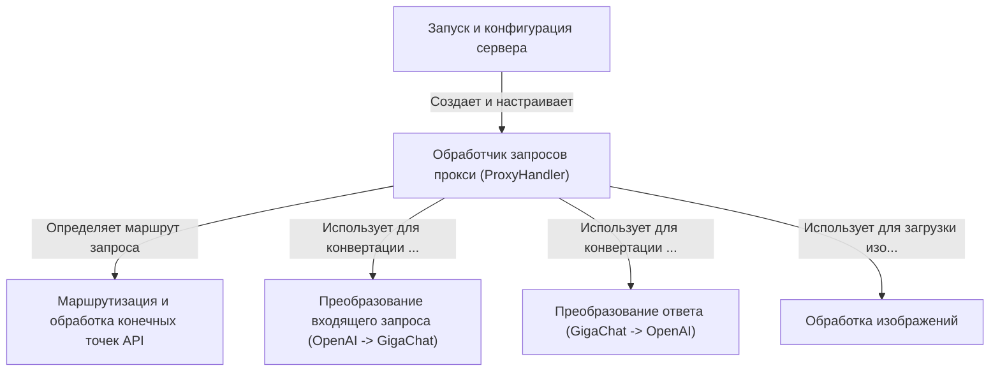

# Tutorial: gpt2giga

Проект **gpt2giga** — это *прокси-сервер*, который действует как **переводчик** между API OpenAI и API GigaChat.
Он позволяет использовать клиенты, созданные для OpenAI (например, ChatGPT), для взаимодействия с моделями GigaChat без необходимости изменять код клиента.
Сервер принимает запросы в формате OpenAI, *преобразует* их для GigaChat, отправляет, получает ответ от GigaChat, *преобразует* его обратно в формат OpenAI и возвращает клиенту. Он поддерживает чаты, эмбеддинги, получение списка моделей и опционально обработку изображений.

**Source Repository:** [https://github.com/ai-forever/gpt2giga](https://github.com/ai-forever/gpt2giga)

## Chapters

1. [Маршрутизация и обработка конечных точек API
](01_маршрутизация_и_обработка_конечных_точек_api_.md)
2. [Обработчик запросов прокси (ProxyHandler)
](02_обработчик_запросов_прокси__proxyhandler__.md)
3. [Преобразование входящего запроса (OpenAI -> GigaChat)
](03_преобразование_входящего_запроса__openai____gigachat__.md)
4. [Преобразование ответа (GigaChat -> OpenAI)
](04_преобразование_ответа__gigachat____openai__.md)
5. [Обработка изображений
](05_обработка_изображений_.md)
6. [Запуск и конфигурация сервера
](06_запуск_и_конфигурация_сервера_.md)

---

Generated by [AI Codebase Knowledge Builder](https://github.com/The-Pocket/Tutorial-Codebase-Knowledge)